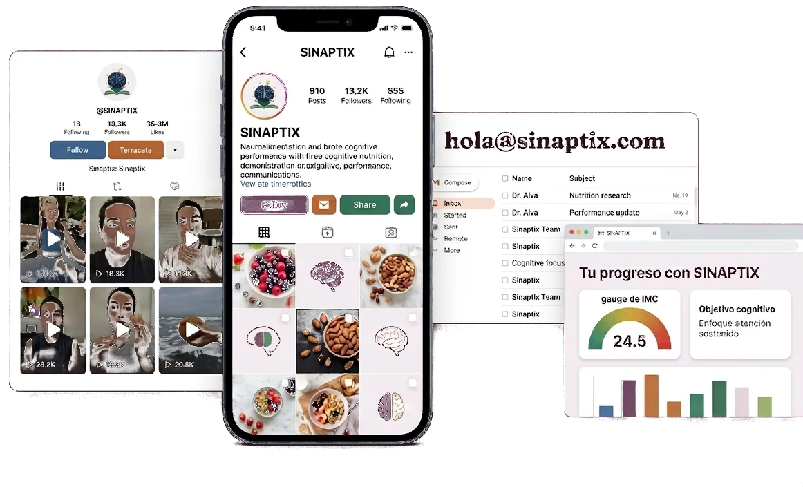

# Changelog — SINAPTIX

> Historial cronológico inverso (la entrada más nueva va arriba) de los
> patches aplicados a este repo. Ver `memoria.md` para el "estado
> presente" del producto y las reglas de cómo se actualiza este archivo.
>
> El historial anterior a esta fecha quedó archivado completo en
> `historico/changelog-2026-09-14.md` (hasta el 14/09/2026) y
> `historico/changelog-2026-09-17.md` (14/09/2026 al 17/09/2026 —
> incluye toda la etapa de login/registro propios de "Mi plan", el
> rediseño del dashboard, la animación de los anillos de Método, y el
> proceso completo de Visión).

## 2026-09-19 — Visión: los 2 pulsos aparecen alternados, no juntos

Pedido del usuario sobre el fundido recién agregado: "puedes hacer que
primero aparezca 1 y luego la otra?". Un solo cambio, mismo archivo:

- **`css/styles.css`**: `.ve-pulse` suma `animation-delay:calc(var(--ph,0)
  * var(--ve-fadeT))` — usa el mismo `--ph` (0 y `.5`) que ya separaba a
  los 2 pulsos en el recorrido, ahora también para el fundido: medio
  ciclo (4s de 8s) de diferencia entre uno y otro. Antes los 2 aparecían
  y desaparecían exactamente a la vez (mismo `@keyframes veFade`, sin
  delay); ahora, mientras uno se apaga el otro está por prenderse. No es
  una alternancia estrictamente excluyente (con ~5s visible de 8s hay un
  margen donde algo de los dos se llega a ver a la vez, sobre todo
  durante los fundidos), pero ya no están sincronizados.
- Verificado con Playwright, leyendo `getComputedStyle(...).opacity` de
  cada `.ve-pulse` segundo a segundo (no solo capturas): confirmado un
  momento con pulso 1 en `opacity:0` y pulso 2 en `opacity:1`, y otro
  exactamente al revés. Sin regresión en mobile. `npm test`: 85/86.

## 2026-09-19 — Visión: el pulso aparece y desaparece (ciclo de 8s, fundido suave)

Pedido del usuario: "puedes hacer que aparezca y desparezca en un cierto
tiempo?". Se preguntó (`ask_user_input_v0`) por los tiempos y el tipo de
transición antes de tocar nada: **ciclo corto** (visible ~5s, invisible
~3s) y **fundido suave** (no corte directo).

- **`css/styles.css`**: `@keyframes veFade` (8s: 0→6.25% fundido de
  entrada [0→0.5s], 6.25%→56.25% visible fijo [0.5s→4.5s], 56.25%→62.5%
  fundido de salida [4.5s→5s; hasta acá los ~5s "visible"], 62.5%→100%
  invisible [5s→8s, los ~3s "desaparece"]) aplicado a `.ve-pulse` (el
  `<g>` que agrupa las 9 capas de cada pulso), no a cada `.ve-p` — así las
  8 capas se apagan juntas en la misma proporción en la que ya estaban,
  sin desarmar el efecto de cola. Sin `--ph` en esta animación: los 2
  pulsos (a media vuelta uno del otro) aparecen y desaparecen **a la
  vez**, es la energía en conjunto la que se prende/apaga, no cada
  cometa por separado. Nueva variable `--ve-fadeT:8s` en `.vision-energy`
  (mismo patrón que `--ve-T`, por si en algún momento se quiere ajustar
  sin tocar el keyframe). `.ve-rail` (el riel de fondo) no se ve afectado,
  sigue siempre visible en su opacidad `.28` — es la pista, no "la
  energía" que aparece/desaparece.
  - `.vision-energy.is-paused` ahora pausa también `.ve-pulse` (antes
    solo pausaba `.ve-p`), para que el fundido no siga corriendo de fondo
    cuando la sección está fuera de pantalla.
- Verificado con Playwright: 8 capturas a lo largo de un ciclo completo
  muestran el fundido de salida, el pulso completamente invisible (solo
  el riel punteado de fondo) y el fundido de entrada de vuelta. Sin
  regresión en mobile. `npm test`: 85/86 (de siempre).

## 2026-09-19 — Visión: el pulso todavía un poco más fino

Segunda vuelta de tuerca sobre el ajuste anterior ("hazlo un poco mas
fino"). Mismo archivo, mismo criterio (proporción entre capas intacta):

- **`css/styles.css`**: `stroke-width` baja de nuevo, esta vez a ~78% del
  valor anterior: de `9.5/1.3/1.6/1.8/2/2.3/2.5/3/1.3` a
  `7.5/1/1.25/1.4/1.6/1.8/2/2.3/1` (glow/t1/t2/t3/t4/t5/t6/body/core). No
  se tocó nada más.
- Verificado con Playwright. `npm test`: 85/86 (de siempre).

## 2026-09-19 — Visión: el pulso más fino (destacaba demasiado)

Pedido del usuario tras ver el resultado del ajuste anterior: "quedo bien,
ahora quiero que lo hagas mas finos porque destaca bastante, (no toques nada
mas)". Cambio puntual, un solo archivo:

- **`css/styles.css`**: los 8 `stroke-width` del pulso (halo + 6 capas de
  cola + cuerpo + núcleo) bajan a ~60% del valor anterior, misma
  proporción entre capas (así la cola se sigue viendo graduada, solo que
  más angosta). De `16/2.2/2.6/3/3.4/3.8/4.2/5/2.2` a
  `9.5/1.3/1.6/1.8/2/2.3/2.5/3/1.3`. No se tocó nada más: ni colores, ni
  opacidades, ni el orden en el DOM, ni la duración, ni `.ve-rail` (el
  riel de fondo).
- Verificado con Playwright: se ve claramente más discreto sin perder el
  efecto de cola ni el color por ícono. `npm test`: 85/86 (de siempre).

## 2026-09-19 — Visión: el pulso pasa por detrás de los íconos y toma su color real (no el de los datos)

Dos ajustes pedidos por el usuario sobre la entrada anterior de hoy mismo,
después de aplicar el patch y mirarlo: (1) que la energía no se dibuje
encima de los íconos sino "como si saliera" de ellos — sin mover nada de
posición — y (2) que el color sea el exacto de cada ícono, porque los que
había elegido (los mismos que usan las `.stat-annot` para cada dato) no
salían como correspondía.

- **Por detrás de los íconos (`index.html`)**: el `<svg class="vision-
  energy">` estaba después de `.vision-icons` en el DOM, así que pintaba
  encima (mismo apilamiento absoluto, gana el que va después). Se movió
  antes: ahora el orden dentro de `.vision-art` es `vision-brain-bg` →
  `svg.vision-energy` → `.vision-icons` → `.stat-annotations`. No se tocó
  ninguna posición/medida — es puro orden de pintado. Funciona porque los
  4 `.webp` de los íconos son recortes con transparencia real (no un
  cuadrado blanco opaco: se confirmó con Pillow, los 4 tienen zonas
  `alpha<200` de sobra), así que el pulso se ve tapado justo donde pasa
  "dentro" del dibujo de cada ícono y asoma en el resto — el efecto de
  "sale del ícono" que se pidió.
- **Color exacto de cada ícono (`css/styles.css`, `js/script.js`)**: se
  reemplazaron los 4 colores (antes `--gold`/`--purple`/`--navy-bright`/
  `--green`, los de las `.stat-annot`) por el color real muestreado de
  cada `.webp` con Python/Pillow — promedio ponderado en HSV de los
  píxeles saturados de cada imagen (se descartó fondo/sombras planas; en
  el cerebro además se aisló el arco naranja del tejido cerebral, que es
  un tono de piel sin relación con "el color" del ícono):
  - dorado (arco del cerebro): `#AD653F` (era `#C1703B` — cercano, el arco
    real es un poco más apagado/marrón)
  - morado (red neuronal): `#8A5C86` (era `#714B67` — el real es más
    violeta y menos rosado/marrón)
  - azul (bustos): `#1355A5` (era `#3B6EA5` — el que más se notaba: el
    ícono es un azul bastante más saturado/profundo que `--navy-bright`)
  - verde (calendario): `#599E71` (era `#2E7D5B` — el real es más claro,
    tipo menta/vidrio)
  - Cambiaron en 3 lugares que tienen que quedar en sync: el
    `initial-value` del `@property --ve-c`, el fallback `--ve-c` fijo en
    `.vision-energy`, y el `@keyframes veColor` estático (resguardo si el
    JS no llega a inyectar el suyo) — los tres en `css/styles.css`. Más
    el `COLOR` que arma `js/script.js` para el `<style
    id="veColorKeyframes">` que se inyecta en runtime (ver entrada
    anterior de hoy para cómo funciona ese cálculo, no cambió, solo los 4
    hex).
- **Verificado con Playwright**: sin errores de consola/página; orden del
  DOM confirmado (`svg.vision-energy` antes de `.vision-icons`);
  keyframes inyectados con los hex nuevos; 6 capturas a lo largo de un
  ciclo a 1440px muestran el pulso entrando/saliendo por detrás de cada
  ícono con su color real (se nota sobre todo en el azul, mucho más
  parecido al ícono ahora). Sin regresión en mobile (`.vision-energy`
  sigue `display:none` a 390px). `npm test`: 85/86 (el de siempre se
  saltea a propósito).

## 2026-09-19 — Visión: el pulso cambia de color al pasar por cada ícono

Pedido del usuario, sobre la entrada anterior de este changelog: "puedes hacer
que cambien de color cada que pasen por un icono, que agarre el color del
icono medio lo toca". Sesión anterior había arrancado esto (colores
elegidos: los mismos de las 4 `.stat-annot`) pero se cortó sin llegar a
commitear nada — se retoma desde cero sobre lo que ya estaba en `main`.

- **Qué se ve**: el pulso (antes un violeta fijo `#8B4FCB`/`#A46CE3`) ahora
  va tomando el color del dato al que se acerca: dorado (`--gold`
  `#C1703B`) en el cerebro, morado (`--purple` `#714B67`) en la neurona,
  azul (`--navy-bright` `#3B6EA5`) en los bustos, verde (`--green`
  `#2E7D5B`) en el calendario — mismos colores que ya usan las 4
  `.stat-annot` para cada dato, para que sea el mismo código de color que
  ya lee la persona en "20%"/"86B"/"1:1"/"4–6". El riel de fondo
  (`.ve-rail`) no cambia: queda fijo en el violeta original, como pista
  estática de referencia.
  - Esto **reemplaza** la decisión de la entrada anterior ("colores más
    vivos que `--purple`... `#714B67` se veía apagado como luz"): esa
    lectura seguía siendo válida para un pulso de un solo color fijo, pero
    con 4 colores turnándose el criterio cambia — acá `--purple` es una
    parada más entre otras 3, no tiene que sostener solo el efecto de
    "energía".
- **`css/styles.css`**:
  - `@property --ve-c{syntax:'<color>';inherits:true;initial-value:#C1703B}`
    al principio del archivo (antes de `.sr-only`, no puede ir dentro de un
    `@media`: los navegadores no soportan `@property` anidado). Es lo que
    permite que el color interpole gradual en vez de saltar de golpe entre
    paradas — sin este registro, un custom property de color no es
    animable, cambia de golpe.
  - `--ve-mid`/`--ve-glow`/`--ve-core` (colores fijos por capa) se
    reemplazan por un solo `--ve-c` animado con `@keyframes veColor`, del
    que cada capa deriva su tono con `color-mix()` (glow y cuerpo más
    claros, núcleo casi blanco) — una sola variable anima las 8 capas del
    pulso a la vez. El `@keyframes veColor` que queda escrito en el CSS
    (fuera del `@media`, por si `.vision-energy` en algún momento se
    habilita a otro ancho) tiene morado/azul/verde a 25/50/75 fijo — sirve
    de resguardo si por lo que sea no llega a correr el JS que lo
    sobreescribe (ver abajo), y de por sí es un reparto razonable.
  - `.ve-rail` pasa a usar una variable propia `--ve-rail-c` (antes
    reusaba `--ve-mid`), fija en el violeta original, para no engancharse
    con el color animado del pulso.
- **`js/script.js`**: en la misma IIFE de `trazar()` que ya medía los 4
  íconos y armaba el `d` del recorrido:
  - `fraccionMasCercana(path, total, punto)`: muestrea el `<path>` del
    riel con `getPointAtLength` (240 pasos) y devuelve en qué punto del
    recorrido (0–100, mismo sistema que `pathLength="100"`) cae el punto
    más cercano a un centro de ícono dado. No se asumió 25/50/75 parejo
    porque los 4 íconos no quedan a igual distancia entre sí (anchos e
    imágenes distintas) — salió morado a 24.6%, azul a 47.5%, verde a
    75.0% en la medición a 1440px, no muy lejos del reparto parejo pero
    tampoco igual.
  - Con esas 3 fracciones (dorado queda fijo en 0%/100%, por ser donde
    arranca/cierra el trazado) arma un `@keyframes veColor` nuevo y lo
    inyecta/actualiza en un `<style id="veColorKeyframes">` en el
    `<head>` (se crea una sola vez, se reescribe el `textContent` en cada
    `trazar()` — cubre resize, igual que el resto de la función). Si las
    3 fracciones no salen en orden creciente y separadas (medición
    inestable, capa sin layout todavía), no se inyecta nada y queda el
    `@keyframes veColor` fijo 25/50/75 del CSS.
  - `getTotalLength()` envuelto en `try/catch` por las dudas de que algún
    navegador lo rechace con el SVG en `display:none` (mobile, ≤900px);
    si falla o da 0, `trazar()` corta ahí y no toca los keyframes.
  - **Evitado a propósito el bug de la sesión anterior**: se había armado
    un regex para leer `--ve-T` desde JS que quedó con la barra doblada
    (`\\d`) y "funcionaba de casualidad" por un valor de reserva de
    7000 ms. Esta implementación no necesita leer `--ve-T` en ningún
    momento: la sincronización entre la posición (`veRun`) y el color
    (`veColor`) sale sola de que `.ve-p` anima ambos keyframes con el
    mismo `animation-delay` (un solo valor en la lista se reutiliza para
    las 2 animaciones, así cada capa de la cola muestra el color que
    tenía la cabeza cuando pasó por ahí, no el color actual de la
    cabeza — efecto de cola con degradé de color, no solo de opacidad).
- **Verificado con Playwright/Chromium** (disponible esta sesión): sin
  errores de consola ni de página; `#veColorKeyframes` se inyecta con los
  valores esperados (24.6%/47.5%/75.0% a 1440px); 6 capturas de
  `.vision-art` a lo largo de un ciclo completo (~7 s) muestran el pulso
  pasando por dorado → morado → azul → verde en el orden y las zonas
  correctas; a 390px `.vision-energy` sigue en `display:none` (sin
  regresión de lo ya oculto en mobile) y sin errores de JS. `npm test`:
  85/86 (el e2e de Playwright se saltea a propósito, como siempre — ver
  "Tests" en memoria.md). Falta la confirmación de siempre sobre un
  navegador real/deploy, en particular que `color-mix()` y `@property` se
  vean bien (son las dos features más nuevas que usa esta entrada, sin
  usarse antes en el sitio).

## 2026-09-19 — Visión: energía morada que recorre el centro de los 4 íconos

Pedido del usuario (con captura donde dibujó un rectángulo negro uniendo el
centro de los 4 íconos): "una animación de especie de energía morada [que]
pase por el centro de los íconos en forma cuadrada, más o menos el recorrido
que te envié".

- **Qué se ve**: dos pulsos de luz violeta (cabeza brillante con núcleo claro
  y cola que se desvanece), a media vuelta uno del otro, girando en sentido
  horario por un rectángulo de esquinas redondeadas (r=26px) que pasa por
  cerebro (arriba izq.) → neurona (arriba der.) → acompañamiento (abajo der.)
  → calendario (abajo izq.). Una vuelta = 7 s (`--ve-T`, una sola variable).
  Además hay un riel punteado muy tenue (`.ve-rail`, opacidad .28) para que el
  recorrido se lea aun cuando el pulso está lejos.
- **`index.html`**: `<svg class="vision-energy">` dentro de `.vision-art`,
  entre `.vision-brain-bg` y `.stat-annotations`. Por pulso, 9 `<path
  pathLength="100">`: `ve-glow` (halo, con `filter="url(#veBlur)"`),
  `ve-t1…t6` (cola), `ve-body`, `ve-core`.
- **`css/styles.css`**: bloque nuevo antes de `#lam-02 .stat-box`. Todo con
  `dasharray` de período 100 y `@keyframes veRun` (`stroke-dashoffset` 0 →
  -100). La "cabeza" de las 9 capas coincide por `animation-delay:
  calc(T * (fase − 1 + L/100))`, así que cada capa puede tener su propio
  largo `L`. Solo `min-width:901px`; `display:none` con
  `prefers-reduced-motion`.
- **`js/script.js`**: IIFE al final. Mide los 4 `.vision-icon--*`, arma el
  `d` (rectángulo por el promedio de los centros de cada columna/fila),
  setea `viewBox` = tamaño de `.vision-art` y el `d` en todos los `<path>`.
  `ResizeObserver` sobre `.vision-art` y los 4 íconos (cubre resize y la
  carga tardía de las imágenes, que recién ahí tienen alto). Un
  `IntersectionObserver` agrega `.is-paused` cuando la sección no se ve.
- **Decisiones**:
  - **Recorrido medido por JS, no en coordenadas fijas**: en las últimas
    sesiones los íconos se movieron varias veces (`--vision-pares-shift`,
    `--vision-bajos-shift`, anchos). Con coordenadas escritas a mano el
    rectángulo se habría desalineado en el siguiente ajuste.
  - **Primera versión descartada**: la cola armada con 3 tramos quedaba
    escalonada (se veían los cortes, tipo tubo de neón por segmentos). Se
    pasó a 6 capas de opacidad baja (.07→.17, opacidad acumulada ~.07 en la
    punta de la cola a ~.5 junto al cuerpo) y el degradado salió continuo.
  - **Encima de los íconos** (no por detrás): así la energía se ve entrar por
    el centro de cada uno y doblar ahí, como en el dibujo del usuario. Pasa
    justo por el hilo de luz de los bustos y por el brote del calendario. Si
    tapa demasiado, mandarla por detrás es cambiar el orden en el DOM
    (poner el `<svg>` antes de `.vision-icons`); con el cristal translúcido
    del calendario se vería igual.
  - Colores más vivos que `--purple` (`#8B4FCB`/`#A46CE3`/`#F4EAFF`): es
    energía, no texto, y `#714B67` se veía apagado como luz.
  - **No se hizo** (queda a pedido): que cada ícono "se encienda" un instante
    cuando la energía pasa por su centro.
  - **Costura del trazado**: para que el pulso cruce el punto donde empieza y
    termina el `<path>` sin cortarse, el `stroke-dasharray` tiene que sumar
    exactamente el `pathLength` (100). Con un gap mayor el pulso desaparecía
    en la costura y reaparecía por la cola.
- **Verificado** con Playwright/Chromium: 8 frames por vuelta a 1440/1920/
  1100px (recorrido por los 4 centros, sin cortes en las esquinas ni en la
  costura), video de 9 s a 1440px, sin errores de JS, oculto a ≤900px (JS ni
  traza) y con `prefers-reduced-motion`, `is-paused` alterna bien al entrar
  y salir de pantalla. Ojo: en headless los `IntersectionObserver` solo
  entregan con frames renderizados (una primera medición dio invertido por
  eso). El desborde horizontal de 207px que reporta el documento es **el
  mismo sin y con este cambio** (medido contra HEAD): preexistente. Falta la
  confirmación de siempre en un navegador real, sobre todo fluidez en
  equipos lentos y Safari (filtro SVG `feGaussianBlur` sobre un trazo animado).
- `npm test`: 85 pass / 1 skipped (e2e del PDF), 0 fail.

Actualiza memoria.md y changelog.md.

## 2026-09-19 — Visión: íconos nuevos para "1:1" (bustos) y "4–6" (calendario)

Pedido del usuario sobre `#lam-02` (con captura): cambiar los íconos
grandes. Se le dio una opinión antes de tocar nada: cerebro, red neuronal
y reloj de arena decían lo que el dato decía y ya habían pasado por varias
tandas de ajuste, así que **solo el nudo azul de "1:1 acompañamiento
personal" ameritaba cambio** (forma abstracta, la más pesada y saturada de
las cuatro). Después el usuario pidió también cambiar el reloj de arena por
"algo como un calendario con unas 2 ojitas" (para "4–6 semanas para notar
el cambio"). Las imágenes las generó el usuario con Gemini.

- **Azul "1:1" → `img/decoraciones-neurona/vision-iconos/icon-acompanamiento.webp`**
  (441×390, 69 KB): dos bustos de fibras azules trenzadas, de perfil y
  enfrentados, unidos por un hilo de luz cian. Reemplaza al nudo de cintas.
  - **1er intento descartado**: dos figuras de cuerpo casi entero sobre un
    pedestal. Al recortar se perdía justo el hilo de luz (casi blanco, poca
    saturación) y las figuras quedaban con la base cortada recta; además eran
    cuerpos anatómicos realistas, de estilo distinto a los otros 3 íconos. El
    prompt había dejado libres encuadre y fondo.
  - **Prompt que sí funcionó** (se cerró explícitamente lo que falló): "bustos
    humanos abstractos (solo cabeza y hombros)... sin rasgos anatómicos ni
    género... hilo de luz cian brillante y bien grueso... composición
    cuadrada, compacto y centrado, mucho margen... fondo blanco puro #FFFFFF
    liso, sin degradado, sin pedestal, sin piso, sin sombra proyectada, sin
    reflejo, sin texto".
  - **Recorte** (Pillow + numpy, no versionado): alfa por saturación
    (`max(rgb)-min(rgb)`, rampa 10→55) y descontaminación del borde
    (`F=(C-(1-α)·B)/α` con B=242, el gris del fondo), recorte al bounding box
    con 20 px de margen, reescalado a 441 px de ancho (el mismo del ícono
    viejo, para que el 32% del CSS dé el mismo ancho visual), WebP q90.
    Probado sobre blanco, lila claro y oscuro: sin halo en fondos claros.
- **Verde "4–6" → `.../vision-iconos/icon-calendario.webp`** (441×454,
  41 KB): calendario de escritorio de cristal esmeralda con anillas,
  cuadrícula, un brote al centro y una lapicera al costado. Reemplaza al
  reloj de arena. Se pidió con "2 ojitas"; Gemini devolvió un brote en vez de
  ojos y el usuario dijo "pongamos esta" (además suena a crecimiento, que
  encaja con "notar el cambio"). La lapicera se dejó.
  - **Recorte por otro método**: el de saturación no servía (cristal
    translúcido y metal gris de la lapicera con saturación casi nula).
    Alfa por distancia al blanco (`min(rgb)`, rampa 250→228), misma
    descontaminación con B=255. Anillas huecas, metal y transparencias del
    cristal se conservan.
- **`index.html`**: solo cambian los 2 `src` (`vision-icon--verde` y
  `vision-icon--azul`).
- **`css/styles.css`**: `.vision-icon--verde` de `top:calc(71% + shift);
  width:22%` a `top:calc(76% + shift); width:33%`. El reloj era angosto
  (309×566) y el calendario es casi cuadrado: a 22% quedaba diminuto, y a
  28% seguía chico al lado del cerebro/neurona (34%). Con 33% y `top:76%`
  (el mismo de `--azul`) verde y azul comparten línea superior. `--azul` no
  cambió. `--vision-pares-shift` y las `.stat-annot` no se tocaron.
- Los 2 archivos viejos (`icon-reloj-arena.webp`, `icon-cintas-azules.webp`)
  **se dejaron en el repo sin uso**: los sigue generando
  `scripts/separar-iconos-vision.py` y sirven para volver atrás.
- **Verificado** con Playwright/Chromium a 1920/1440/1100px, esperando a que
  termine la animación de entrada (una primera captura salió a mitad de
  fade y engañaba con los colores): no tapan los textos de las anotaciones
  ni los conectores punteados. En ≤900px los íconos siguen ocultos (sin
  cambios). A 1100px "86B neuronas..." se corta contra el borde derecho: es
  el desborde preexistente de esa columna (las `.stat-annot` no se tocaron).
  Falta la confirmación de siempre sobre un navegador real/deploy.
- El bloque nuevo es más saturado que cerebro y neurona (pastel); si
  desentona se le baja saturación o tamaño con una línea de CSS/`filter`.
- `npm test`: 85 pass / 1 skipped (e2e del PDF), 0 fail.

Actualiza memoria.md y changelog.md.

## 2026-09-19 — Login de "Mi plan": más espigas (sobre todo a la izquierda) + frutilla y uva

Pedido del usuario sobre la pantalla de login (`#miPlanSinSesion`): "más de
estos" (`svg/deco-espiga.svg`), "más del lado izquierdo, grandes y
pequeñas", y "otras frutas como frutilla y uva".

- **Assets nuevos**: `svg/deco-blob-strawberry.svg` y
  `svg/deco-blob-grapes.svg` (no existían frutilla ni uva en el repo).
  Dibujados a mano en el mismo lenguaje que el resto de `deco-blob-*.svg`
  (viewBox 200×200, disco orgánico translúcido de fondo, degradados
  radiales para volumen, elipse de sombra; 2,0 y 3,6 KB). Frutilla:
  cuerpo rojo con semillas crema, cáliz verde y brillo. Uva: racimo de 15
  granos en 3 tonos de violeta con brillos, tallo y una hoja. Los `id` de
  gradientes están prefijados (`st*`, `gp*`) para no chocar si algún día se
  inlinean.
- **`mi-plan.html`** (a nivel de sección, full-bleed, junto a las demás
  decoraciones), todas con la clase nueva **`.deco-solo-login`**:
  - **5 espigas** (`svg/deco-espiga.svg`, la de las esquinas): un manojo en
    el margen izquierdo entre la naranja y las almendras (grande 86×353,
    mediana 60×246, chica 40×164, con distinta inclinación, la base de la
    grande justo sobre las almendras) + 2 chicas sueltas arriba a la
    izquierda (36×148 y 28×115).
  - **Frutilla** (112px) y **uva** (122px) entre el manojo y la tarjeta.
- **`css/styles.css`**: `#miPlan:has(#miPlanSinSesion.hidden)
  .deco-solo-login{display:none}` — espejo exacto de `.deco-solo-sesion`
  (visibles mientras el login está a la vista; ocultas con sesión y con la
  encuesta inline). No fuerzan `display`, así que en ≤720px siguen ocultas
  por las reglas generales de `.deco-scribble`/`.deco-fruit`.
  - Frutilla y uva llevan además `.deco-solo-login--cerca` y se ocultan en
    **≤1180px**: la tarjeta empieza en x=(ancho−416)/2 y por debajo de eso
    se metían detrás de ella (medido: uva 48px a 1100px, frutilla 46px a
    1000px, hasta 138px a 780px). Las espigas no: son línea fina y viven en
    el margen (a 780px la mediana toca 19px de la tarjeta, sin efecto visible).
- Las 3 espigas/2 frutas existentes de las esquinas y las 4
  `.deco-solo-sesion` no se tocaron; las posiciones de arriba se eligieron
  para no pisar naranja (y=250–365), aguacate ni almendras/kiwi de abajo.
  `top` en px medido desde arriba (donde está la tarjeta), así el manojo
  se mantiene en su sitio aunque la sección crezca (pestaña "Registrarme",
  monitores altos).
- **Verificado** con Playwright/Chromium (sesión mockeada, fuentes reales) a
  1920/1600/1440/1280/1200/1100/1000/900/780/700/390px: 0 desborde
  horizontal en todos; 0 solapes con la tarjeta desde 1200px hacia arriba;
  ≤1180px se ocultan solo frutilla y uva; ≤720px se ocultan todas; con
  sesión iniciada `.deco-solo-login` queda en `display:none` y
  `.deco-solo-sesion` sigue visible; pestaña "Registrarme" sin problema.
  Falta la confirmación de siempre sobre un navegador real/deploy.
- `npm test`: 85 pass / 1 skipped (e2e del PDF), 0 fail.

Actualiza memoria.md y changelog.md. Se aplica encima del patch
"botón Actualizar + frutas solo con plan" de esta misma fecha.

## 2026-09-19 — "Mi plan": botón "Actualizar" en "Tu estado actual" + frutas nuevas solo con el plan cargado

Dos pedidos del usuario (con capturas de `mi-plan.html` con sesión y plan
cargado), ambos sobre esa pantalla.

- **Botón "Actualizar" en la tarjeta "Tu estado actual"** (`#miPlanBarras`).
  El usuario dejó a criterio de quién implementaba si iba en la tarjeta de
  arriba (Objetivo cognitivo) o en la propia de barras. Se puso **en el
  encabezado de la propia tarjeta, a la derecha del título**: la acción
  cambia justo esos 4 valores (foco/memoria/energía/calma), queda a la vista
  sin sumar una fila ni empujar las barras, y no se duplica con el "Generar
  mi plan" de la tarjeta Cierre (que rehace la encuesta completa; esto es el
  chequeo corto de 4 preguntas). Pastilla blanca translúcida con borde
  morado suave, ícono de flechas circulares que gira 180° al hover
  (respeta `prefers-reduced-motion`) y `:focus-visible`.
  - `js/nutricion-planes.js`: `nutriBuildBarChartHTML(objetivo, reeval,
    opciones)` — tercer parámetro **opt-in** `{conBotonActualizar:true}`;
    el título pasa a `.bar-chart-head` (flex). Sin la opción el HTML es el
    de antes salvo por el contenedor del título (no hay botón muerto donde
    no hay handler). Único llamador: `pintarMiPlan()` en `js/mi-plan.js`.
  - **Modal de reevaluación en `mi-plan.html`** (`#modalReevaluacion`):
    copia de las mismas 4 preguntas de `index.html` (mismos `name`
    `reevalEstres/-Fatiga/-Concentracion/-Olvidos`, mismos ids
    `#formReevaluacion`/`#reevalResultado`), texto adaptado ("…contra tu
    diagnóstico inicial en «Tu estado actual»"). **Mismo dato**:
    `sinaptix_reevaluacion` + `planSyncGuardar('reevaluacion', …)`, así lo
    que se responde acá también se ve en los anillos de Método y en el PDF.
  - `js/mi-plan.js`: como esta página no carga `js/script.js`, el
    abrir/cerrar del modal vive acá (botón ×, click fuera, Esc; devuelve el
    foco al botón). El botón se recrea en cada `pintarMiPlan` (`innerHTML`),
    por eso el click es **delegado** sobre `#miPlanBarras` (contenedor
    fijo). Al guardar se repinta enseguida (detrás del velo del modal): barras
    nuevas, líneas "Antes: …" y etiquetas "Qué cambió desde tu diagnóstico"; el
    modal se cierra a los 900 ms como el de Método.
  - `css/styles.css`: `.bar-chart-head`, `.bar-chart-refresh`.
- **Frutas nuevas que aparecen SOLO con el plan cargado** (pedido: con el
  plan, la parte de abajo — el detalle — quedaba sin frutas y se veía
  pelada; "que no estén tan repetidas"; "mientras tanto que no aparezcan").
  Con plan la sección mide ~1800px (sin plan ~1080) y las frutas de siempre
  terminaban cerca de los 1000px. 5 nuevas, todas de
  `img/generadas-cutout/` (ninguna repite kiwi/naranja/palta/almendras/
  arándanos/nuez): **remolacha** y **té** a la izquierda, **granada**,
  **espinaca** y **chocolate** a la derecha, en `mi-plan.html` con clase
  `.deco-solo-plan`. `top` en **% de la altura de la sección** (no px) para
  que se repartan parejo con un plan corto o largo.
  - `pintarMiPlan()` pone `.has-plan` en `#miPlan` según si el **detalle del
    plan quedó realmente visible** (no por existir la clave en
    localStorage: con datos corruptos no hay nada largo que decorar).
  - `css/styles.css`: `.deco-solo-plan{display:none}` por defecto; se
    muestran con `#miPlan.has-plan` **dentro de `@media(min-width:721px)`**
    (una `display:block` más específica le ganaría al `display:none` de
    `.deco-fruit` en mobile); con el login visible se ocultan igual que
    `.deco-solo-sesion`. `loading="lazy"` + `display:none` ⇒ sin plan ni
    siquiera se descargan los 5 webp (~190 KB).
  - Entre 1200 y 780px se asoman por detrás de las tarjetas (solape de
    ~45–65px), **igual que las 4 `.deco-solo-sesion` que ya existían**
    (medido: mismos valores). Se dejó así por coherencia; si molesta, se
    puede ocultar `.deco-solo-plan` en `≤1200px` con una línea.
  - Estilo: son recortes con `drop-shadow` (mismo tratamiento que Pilares/
    Beneficios), a diferencia de las frutas de arriba que traen un disco
    pastel detrás. Alternativa no aplicada: ponerles un disco suave detrás
    para unificar.
- **Verificado** con Playwright/Chromium (sesión mockeada, fuentes reales
  Inter/Fraunces/Caveat de `@fontsource`): botón visible con y sin
  reevaluación previa; flujo completo (abrir → error al enviar vacío → Esc →
  click fuera → responder 4 → guardar → `localStorage` → barras, deltas y
  chips actualizados → el botón sigue funcionando tras el repintado → 2ª
  apertura con el formulario limpio); frutas: 5 visibles con plan a 1440px,
  ocultas sin plan, sin sesión y a 390px; 0 desborde horizontal a 1440/1280/
  1200/1100/1000/900/780/700/390px. **No se probó** completar la encuesta de
  8 pasos de punta a punta para ver aparecer las frutas en caliente (usa el
  mismo `pintarMiPlan`, verificado en las dos ramas al cargar). Falta la
  confirmación de siempre sobre un navegador real/deploy.
- `npm test`: 85 pass / 1 skipped (e2e del PDF, Playwright no instalado
  en el repo), 0 fail.

Actualiza memoria.md y changelog.md.

## 2026-09-19 — "Mi plan": fondo crema elegido para la tarjeta del título

Cierra la decisión que había quedado abierta en la entrada anterior (el
lila se probó y se rechazó). El usuario avisó que esperaba la crema que
se le había mostrado en la vista previa y pidió que se aplicara.

- **`css/styles.css`**: `.miplan-titlecard` pasa del gradiente
  `linear-gradient(135deg,#FFFFFF 0%,var(--paper-2) 55%,#F5EAF2 100%)` a
  **`background:#FDF4EA`** (crema dorado, la opción recomendada de las 3
  que se mostraron con vista previa: blanco `--paper`, crema `#FDF4EA` y
  morado de marca `#4B2E45`). Sigue haciendo juego con el círculo dorado
  de "SINAPTIX" y no compite con las 3 tarjetas de color de abajo (verde,
  dorado, lila). Borde, radio y sombra sin cambios.
- **Verificado** en el navegador integrado a 1440×900 con la sesión
  simulada: fondo computado `rgb(253, 244, 234)`, `background-image:none`,
  tarjeta en 122px de alto / top 92 (igual que antes) y título en 48px
  dentro de su caja de 48px.
- `npm test`: 85 pass / 1 skipped (el e2e de Playwright del PDF, no
  instalado), 0 fail.

Actualiza memoria.md y changelog.md.

## 2026-09-19 — "Mi plan": título más grande, 4 frutas solo con sesión y cerebro del login más a la izquierda

Tres pedidos del usuario en la misma sesión, todos sobre `mi-plan.html`.

- **Título de `.miplan-titlecard` más grande sin mover nada** (pedido: "el
  título de Tu progreso con SINAPTIX más grande sin mover nada más, ni las
  tarjetas ni los íconos"): en `css/styles.css`,
  `#miPlanConSesion .sec-head-center .lam-title` pasa de
  `font-size:clamp(30px,3.9vw,42px)` a `clamp(32px,4.35vw,48px)` (42 → 48px
  en desktop) y se le fija `line-height:clamp(34.5px,4.485vw,48.3px)`, que
  es exactamente el alto de caja que daba `1.15 ×` el tamaño anterior. Así
  la caja del `<h2>` mide lo mismo que antes en cualquier ancho y no empuja
  hacia abajo la tarjeta ni el resto del panel. Medido a 1440×900: caja del
  título 48px (igual), tarjeta 122px de alto / top 92 (igual), `.miplan-grid`
  en 282 (igual), e íconos con el mismo tamaño y misma altura (46·60·76 y
  76·60·46, tops 130·123·115) — lo único que cambia es que el título pasa de
  395px a 451px de ancho, así que los 6 íconos se reparten el espacio que
  queda (se corren ~10-20px en horizontal, sin cambiar de tamaño).
- **Fondo de esa tarjeta: lila probado y RECHAZADO**. A pedido del usuario
  ("poné la tarjeta del título del color de la tarjeta de cierre") se puso
  `background:var(--miplan-card-lila)` (#EFE1EC, el sólido de
  `#miPlan .miplan-cierre`); su respuesta fue "no me gustó". Se le mostraron
  3 opciones con vista previa (blanco `--paper`, crema dorado `#FDF4EA`
  —la recomendada, hace juego con el círculo dorado de "SINAPTIX"— y
  morado de marca `#4B2E45` con texto claro e íconos aclarados) y **quedó
  sin decidir**: el archivo vuelve al gradiente
  `linear-gradient(135deg,#FFFFFF 0%,var(--paper-2) 55%,#F5EAF2 100%)` de
  siempre, con un comentario en la regla que deja constancia de la prueba
  descartada.
- **4 frutas nuevas, solo para el dashboard** (pedido: "poné más frutas por
  esta parte, sin tapar las tarjetas" y, al verlas en el login, "que sean
  solo de Mi plan, no del login"): en `mi-plan.html`, 4 `deco-fruit` más
  (berries arriba a la izquierda, walnut a media altura a la izquierda,
  orange arriba a la derecha, berries abajo a la derecha) en los márgenes
  laterales libres, con `left`/`right` negativos para que cuelguen del borde
  de la ventana como el resto. Llevan la clase `.deco-solo-sesion` y
  `css/styles.css` agrega `#miPlan:has(#miPlanSinSesion:not(.hidden))
  .deco-solo-sesion{display:none}` (mismo uso de `:has()` que ya había en 3
  reglas del archivo): se ven con sesión iniciada y desaparecen en la
  pantalla de login. **No se pusieron dentro de `#miPlanConSesion`**: ahí el
  marco de referencia pasa a ser `.wrap` (`position:relative`) y quedaban
  122px metidas hacia adentro, pegadas a las tarjetas; a nivel de sección
  siguen colgando del borde. Verificado a 1440/1200/1000/900/780px: 0
  solapes con las tarjetas y, con el login visible, las 4 en `display:none`.
- **Cerebro del login 100px más a la izquierda** (pedido: "movés el cerebro
  del login más hacia la izquierda"): `.miplan-locked-brain.is-right` pasa
  de `right:-300px` a `right:-200px`. Medido a 1440: de `1002..1562` a
  `902..1462`, mismo tamaño (560px) y misma altura; la parte que ahora cae
  detrás de la tarjeta de login queda oculta (la tarjeta tiene fondo sólido
  y pinta encima).
- `npm test`: 85 pass / 1 skipped (el e2e de Playwright del PDF, no
  instalado), 0 fail.

Actualiza memoria.md y changelog.md.

## 2026-09-19 — Visión: los 4 pares más arriba, la libreta verde más chica y la fila de abajo más abajo

Pedidos del usuario sobre los 4 íconos con sus anotaciones de `#lam-02`
("Nuestra visión"), en dos tandas.

- **Más arriba, en conjunto**: pedido "hacé más arriba los 4 textos y los 4
  íconos en conjunto". `--vision-pares-shift` (variable de `.vision-art`, en
  % de su altura) pasa de `-11%` a **`-17%`**: a 1440px (`.vision-art` mide
  297px de alto) son 51px en total en vez de 33px, o sea 18px más arriba.
  Medido: íconos de arriba 256 → 238, de abajo 523 → 505, anotaciones
  389 → 372 y 680 → 662. Los 8 elementos se mueven juntos y, como el
  desplazamiento es el mismo para íconos y textos, la separación entre
  ambos no cambia.
- **La libreta verde, un poco más chica**: pedido "hacé un poquito más
  chicos los íconos de la libreta verde". `.vision-icon--verde`
  (`icon-calendario.webp`) pasa de `width:33%` a **`29%`**: 160px → 141px a
  1440px (−19px), mismo `left:0%` y mismo `top` (encoge desde su esquina
  superior izquierda).
- **Fila de abajo más abajo, con sus textos**: pedido "hacé un poquito más
  abajo los íconos de la libreta verde y el de los 2 hombres azules,
  bajalos en conjunto con su respectivo texto". Se agrega una segunda
  variable, **`--vision-bajos-shift:5%`**, que se suma (además de
  `--vision-pares-shift`) a los 2 íconos de la fila de abajo
  (`.vision-icon--verde` y `.vision-icon--azul`) y a sus 2 anotaciones
  (`.stat-annot--verde` y `.stat-annot--azul`). A 1440px el 5% ≈ 15px:
  íconos 505 → 520 y textos 662 → 677, sin tocar la fila de arriba
  (cerebro/20% en 238 y red neuronal/86B en 372). Queda parametrizado en dos
  valores independientes: `--vision-pares-shift` mueve los 8 elementos y
  `--vision-bajos-shift` solo la fila de abajo.
- `npm test`: 85 pass / 1 skipped (el e2e de Playwright del PDF, no
  instalado), 0 fail.

Actualiza memoria.md y changelog.md.

## 2026-09-19 — Ajustes de decoración: Pilares sin la onda azul, uva en lugar de la hoja, login sin uva/almendras y collage más chico

Tanda de pedidos del usuario, todos de decoración/espaciado, sin tocar
contenido ni lógica.

- **Pilares (`#lam-04`) — fuera la "raya celeste"**: pedido "quitá esa raya
  celeste que está abajo del título Cuatro frentes de trabajo". Era el
  bloque `.signal-wave` (`svg/signal-wave.svg`, onda con trazo `#3B6EA5` =
  `--navy-bright`). Se borró del `index.html`. Ocupaba **90px** de alto
  (44 de imagen + `margin:6px` arriba + `40px` abajo), así que ese espacio
  se conserva con una regla nueva, `#lam-04 .lam-text-center{margin-top:74px}`
  (el párrafo tenía `margin:-16px auto 44px`; −16 + 90 = 74): verificado que
  el párrafo y las 4 tarjetas quedan **exactamente** donde estaban
  (párrafo en y=363, `.pillar-grid` en y=479). Sin esa compensación el
  párrafo subía y se superponía al rayón morado bajo el título (comprobado
  antes de agregarla). El asset sigue en uso en el Hero (`index.html`,
  `.deco` de `#lam-01`) y las reglas `.signal-wave{...}` quedan huérfanas
  en `css/styles.css` (no se borran, mismo criterio que el resto del repo).
- **Pilares — la hoja de la derecha pasa a ser el racimo de uva**: pedido
  "reemplazá la hoja que está al lado derecho por el racimo de uva" y
  después "hacelo más grande". La hoja fina
  (`svg/deco-leaf-beneficios.svg`, `right:70px;top:225px;width:60px`,
  `opacity:.6`, `rotate(-8deg)`) se reemplazó por
  `svg/deco-blob-grapes.svg` en el mismo lugar y con los mismos valores, y
  después se subió el ancho a **110px** (con 60px se veía chico al lado de
  la naranja de 110 y la granada de 180). Verificado que no se solapa con
  el título, el párrafo ni las 4 tarjetas (caja final 110×110). La hoja
  sigue en uso en Beneficios (`#lam-05`) y el asset de la uva, que había
  quedado sin uso al sacarla del login, vuelve a usarse.
- **Pilares — fuera el huevo**: pedido "en la parte izquierda quitale el
  huevo". Se borró el `.deco-fruit` de abajo a la izquierda
  (`img/generadas-cutout/huevo.webp`, `left:20px;bottom:-30px`). El asset
  sigue en uso en el collage de Conócenos (`#lam-06`). No se movió nada
  más (los decos son absolutos: `.pillar-grid` quedó en y=479).
- **Login de "Mi plan" — fuera la uva y las almendras**: pedido "quitá la
  fruta que está arriba del kiwi y también el racimo de uvas (las frutas
  están del lado izquierdo)". Se borraron del `index.html`: la uva
  (`svg/deco-blob-grapes.svg`, `deco-solo-login--cerca`, `left:238px;
  top:580px`) y las almendras del margen izquierdo
  (`svg/deco-blob-almonds.svg`, `left:-20px;bottom:180px`), que era la
  fruta que quedaba justo arriba del kiwi. Verificado: 0 uvas y 0
  almendras sueltas en el DOM; la columna izquierda queda con las espigas,
  la naranja arriba, la frutilla y el kiwi abajo. Sigue estando la otra
  almendra (`.miplan-locked-fruit is-almonds`, pegada a la esquina
  inferior izquierda de la tarjeta, no arriba del kiwi) — se le avisó al
  usuario y quedó.
- **Login de "Mi plan" — tarjeta más chica "en conjunto"**: pedido "hacé
  más pequeña la tarjeta de inicio de sesión (en conjunto)".
  `.miplan-locked-card` lleva ahora **`zoom:.9`**: encoge la tarjeta
  completa (texto, campos, botones y espaciados) en una sola proporción.
  Se usó `zoom` y no `transform:scale` porque la tarjeta lleva `.reveal` y
  `.reveal.in{transform:translateY(0)}` pisa cualquier `transform` (mismo
  caso que `.conocenos-collage`). Medido a 1440px: ~414×660 visibles en vez
  de 460×733, centrada y con todos los internos proporcionales.
- **Conócenos (`#lam-06`) — collage un poco más chico**: pedido "hacé un
  poquito más chico el collage". `--collage-bleed` pasa de
  `clamp(0px,calc((100vw - 1180px)/2 + 100px),280px)` a
  `clamp(0px,calc((100vw - 1180px)/2 + 70px),250px)`. Medido a 1440×900:
  **866×525 → 836×507** y, al encoger desde el sangrado, el collage entra
  completo (ya se ven enteras las tarjetas "hola@sinaptix.com" y "Tu
  progreso con SINAPTIX", que antes quedaban cortadas por el borde).
- `npm test`: 85 pass / 1 skipped (el e2e de Playwright del PDF, no
  instalado), 0 fail.

Actualiza memoria.md y changelog.md.

## 2026-09-19 — Íconos de la tarjeta de título de "Mi plan" (calco de referencias)

El usuario mandó 6 imágenes de referencia (line-art generado con Gemini:
cerebro tipo nuez, espiga, arándanos, neurona, gota, cítrico en corte) y
pidió calcarlas para convertirlas en íconos SVG y reemplazar los 6 que
ya estaban en `.miplan-titlecard` ("Tu progreso con SINAPTIX").

### Cambios

- Se sobrescriben los mismos 6 archivos de la ronda anterior,
  `svg/icon-titlecard-{berries,grain,walnut,citrus,drop,neuron}.svg`,
  con un calco real de las 6 imágenes del usuario en vez de la
  geometría simplificada hecha a mano. Mismo mapeo de significado y
  mismo nombre de archivo que antes, así que no hace falta tocar
  `mi-plan.html` ni `css/styles.css`.
- **Pipeline**: Pillow para limpiar ruido JPEG (filtro de mediana),
  recortar al contenido, engrosar el trazo fino de las referencias
  (`MinFilter`, para que el peso visual del trazo quede parejo con el
  resto del set) y binarizar → `potrace` (paquete de apt, instalado en
  el entorno de trabajo) para vectorizar → recentrado en
  `viewBox="0 0 300 300"` (mismo margen que ya usaba el resto del set)
  y recoloreado a `#4B2E45`. Quedan como `<path>` con relleno (lo que
  arma potrace al vectorizar un dibujo de líneas), no como `stroke` sin
  relleno como el resto del set hecho a mano — no se nota la
  diferencia en un ícono estático sin hover.
- Peso: subieron de ~600 bytes cada uno a 3.8–9.8 KB (40 KB los 6
  juntos) por ser un calco real con más nodos de curva, no geometría
  simplificada. Se probó primero a mayor resolución de trabajo (~95 KB
  los 6) y se bajó sin pérdida visible al tamaño real de uso
  (30–76px).
- Verificado con Playwright: los 6 aislados a 300×300 contra las
  referencias originales, y la tarjeta real de `mi-plan.html` con
  sesión mockeada a 1440px y 390px (en mobile los íconos siguen
  ocultos por la regla `≤760px` ya existente, sin cambios ahí). Falta
  la confirmación de siempre sobre un navegador real/deploy.

## 2026-09-19 — Íconos de la tarjeta de título de "Mi plan"

El usuario mandó una captura del dashboard y pidió cambiar los 6 íconos
de `.miplan-titlecard` ("Tu progreso con SINAPTIX"): eran esferas
glossy/3D degradadas y no le gustaban. Pidió algo tipo "dashboard" o
como el cerebro de la tarjeta "Objetivo cognitivo", y sugirió que
podían ser frutas con ese mismo estilo.

### Cambios

- 6 SVG nuevos, `svg/icon-titlecard-{berries,grain,walnut,citrus,drop,
  neuron}.svg`: un solo trazo sin relleno, color horneado
  `#4B2E45` (no `currentColor`, son `` y no heredan CSS de la
  página) — mismo criterio visual que
  `img/ilustraciones-mi-plan/objetivo-cerebro.png`. Diseñados y
  probados primero de forma aislada con Playwright a los tamaños reales
  de uso (30–76px) antes de integrarlos, para asegurar que se leyeran
  bien también en el extremo chico.
- `mi-plan.html`: los 6 `` de `.miplan-titlecard-icons` pasan de
  `img/Iconos/icon-*.webp` a los SVG nuevos, mismo mapeo de significado
  que antes y mismo orden/tamaños (ya los fija el CSS por `nth-child`):
  antioxidantes→arándanos, complejo B→espiga, omega 3→nuez (además se
  parece a un cerebro chico), energía cerebral→cítrico en corte,
  hidratación→gota, neuronas→neurona.
- `css/styles.css`: se saca `filter:drop-shadow(...)` de
  `.miplan-titlecard-icons img` — le daba volumen a las esferas viejas,
  no corresponde con íconos de línea plana (el cerebro vecino tampoco
  lleva sombra).
- Se borran `img/Iconos/icon-energia-cerebral.webp` e
  `icon-neuronas.webp` (sin otra referencia en el repo).
  `icon-antioxidantes/-complejo-b/-omega3/-hidratacion.webp` no se
  tocan: siguen en uso en las tarjetas `.pillar` de `#lam-04`.
- Verificado con Playwright (disponible esta sesión) contra el HTML
  real: la tarjeta completa a 1400px se ve cohesiva con el resto del
  dashboard (mismo estilo que el cerebro de "Objetivo cognitivo" y los
  íconos de línea de "Cierre"). Falta la confirmación de siempre sobre
  un navegador real/deploy.

## 2026-09-18 — PDF de "Mi plan": tarjetas de arriba más compactas (2da vuelta)

El usuario volvió a revisar el PDF (ya con la paleta neutra de la vuelta
anterior) y marcó que las gráficas de la parte de arriba "se seguían
viendo estiradas hacia abajo" y pidió achicar también el panel de
OBJETIVO COGNITIVO PRINCIPAL.

### Causa

Las tarjetas de barras/IMC y el panel de objetivo tenían alto fijo mayor
del que su contenido necesitaba: filas de barra de 8,6 mm cuando 6,4 mm
alcanzan, y el bloque de IMC con offsets pensados para una tarjeta más
alta, dejando ~9-13 mm de aire muerto al pie. El panel de objetivo sumaba
17,5+4 mm de aire fijo además del texto.

### Cambios

- `BARRA_ROW_H` (nueva constante): 8,6 → **6,4 mm** por fila. La tarjeta de
  4 barras pasa de ~53 a **~41 mm** de alto.
- Bloque de IMC (`dibujarImc`) reescrito con offsets propios para la nueva
  altura: número de 19 → 16pt, barra segmentada de 2,4 → 2,2 mm, gaps entre
  elementos recalculados para no dejar aire al pie.
- Panel de objetivo (`dibujarObjetivo`) reescrito: el alto ahora se calcula
  sumando lo que ocupan sus líneas de texto reales (rótulo + título +
  enfoque + paddings fijos chicos), no una fórmula con aire de sobra.

### Bug encontrado de paso: título largo se salía del panel

Con un objetivo que resuelve en varios planes ("Foco y Concentración +
Reducir Fatiga Mental + Sostener Memoria de Trabajo + Manejo de Estrés
Mental"), el título a una sola línea medía ~200 mm contra ~166 mm
disponibles — se salía del panel por la derecha. No era nuevo de esta
sesión, pero al reescribir la función se corrigió: el título prueba a
12,5pt: si no entra en 2 líneas, baja de a 1,5pt hasta que entra (o hasta 3
intentos), y el alto del panel crece con la cantidad real de líneas del
título, no con un número fijo.

### Resultado

Los casos con un solo plan (sin antropometría, o con reevaluación) pasan de
2 a **1 página**. El caso más cargado (objetivo combinado en 4 planes)
sigue en 3, ahora con el título del panel legible en 2 líneas en vez de
cortado contra el borde.

`docs/mockup-pdf-mi-plan.html` se actualizó a la misma densidad. No se
tocó el modelo de datos, solo el dibujo — la suite de tests no cambia por
esto (quedó en 90/90 tras el `npm i` + `npm test` de verificación previos a
este commit; los 10 tests de más que 80→90 son de otras sesiones que
trabajaron el repo en paralelo, no de este cambio).

### Archivos tocados

`js/mi-plan-pdf.js`, `docs/mockup-pdf-mi-plan.html`, `memoria.md`,
`changelog.md`.

## 2026-09-19 — Mi plan: título en tarjeta con íconos y botones de Cierre rediseñados

El usuario (con capturas y un boceto propio) pidió dos cosas: que los 3
botones de la tarjeta "Cierre" se vieran más estéticos, y meter el título
"Tu progreso con SINAPTIX" dentro de una tarjeta angosta, pareja con las dos
de "Datos clave" o sobresaliendo si quedaba mejor, con íconos a los lados.

### Botones de Cierre

- **Qué estaba mal**: los 3 son `<button>` nativos y `.btn`/`.btn-solid` se
  escribieron para `<a>` (sin `border:none`), así que el sólido mostraba el
  borde gris del navegador; el texto quedaba pegado a la izquierda
  (`.btn` es `inline-flex` y `text-align:center` no centra en flex); y los
  3 pesaban igual, sin jerarquía.
- **Ahora** (`css/styles.css`, bloque `.miplan-cierre-btns`): apilados a todo
  el ancho, texto centrado con ícono y 3 niveles: **principal** "Generar mi
  plan" (morado degradado con sombra, ícono de destellos), **secundario**
  "Descargar mi plan en PDF" (claro, borde morado fino, ícono de documento
  con flecha) y **terciario** "Cerrar sesión" (sin caja, con una línea fina
  arriba que lo separa como salida de la cuenta; en hover se pone rojo).
- ⚠️ **Los íconos van como `::before` con `mask` (SVG en data-URI) y NO como
  `<svg>` dentro del botón, a propósito**: `js/mi-plan-pdf.js` hace
  `btn.textContent = 'Generando PDF…'` y luego lo restaura, y eso borraría
  para siempre un `<svg>` hijo. Un pseudo-elemento sobrevive. Verificado:
  tras el click (camino de error, jsPDF bloqueado) el ícono sigue. No se
  tocó nada de JS ni del HTML de los botones, y el test e2e del PDF
  (`textContent.trim() === 'Descargar mi plan en PDF'`) sigue valiendo.
- Estado `disabled` (mientras genera el PDF): opacidad y cursor `progress`.

### Tarjeta del título

- **`mi-plan.html`**: el `<h2>` pasa a vivir dentro de
  `.sec-head-center.miplan-titlecard`, con `.miplan-titlecard-icons` a cada
  lado (`aria-hidden`, `alt` vacío). Se conserva la clase `.sec-head-center`
  para que sigan valiendo las reglas del título (30-42px, círculo dorado en
  "SINAPTIX"); las clases `reveal in d1` pasaron del `<h2>` a la tarjeta.
- **Íconos**: los de `img/Iconos/` que ya usa el sitio (nutrientes y
  cerebro), 3 por lado, chicos → grandes hacia el título como en el boceto:
  izquierda antioxidantes / complejo B / omega-3; derecha energía cerebral /
  hidratación / neuronas. `justify-content:space-evenly` los reparte a lo
  ancho en vez de amontonarlos junto al título.
- **Ancho: se dejó PAREJA con las tarjetas de abajo** (mismos bordes que
  `.miplan-grid`), no sobresaliendo. Se probó la variante ancha (`margin-inline:-40px`
  en ≥1240px): los íconos no ganan nada y sobra aire en los extremos, además
  de desalinear el borde con "Datos clave". Si igual se prefiere, es una sola
  línea: `@media(min-width:1240px){.miplan-titlecard{margin-inline:-40px}}`.
- **Responsive**: ≤760px los íconos se ocultan (queda el título centrado en
  la tarjeta); de 761 a ~1000px los íconos escalan con `clamp()`.
- Fondo blanco → lila muy suave, borde morado fino y sombra suave, para que
  se lea distinta de las tarjetas pastel de datos. Altura ~120px en desktop.
- **Verificado con Playwright** (Inter/Fraunces/Caveat reales) a 1600, 1280,
  900 y 390px: sin scroll horizontal ni errores de consola; estados normal,
  hover de los 3 botones, error de PDF y sin plan (2 botones). Suite: 85
  pasan (no hay tests nuevos: es CSS/HTML).

## 2026-09-19 — Mi plan: nota explicativa bajo las etiquetas de cambios

El usuario vio en su navegador las etiquetas "Qué cambió desde tu
diagnóstico" (patch anterior) y notó que aún sobraba un poco de espacio en la
tarjeta verde; propuso un párrafo informativo.

- **`mi-plan.html`**: `
` dentro de
  `#miPlanCambios`, debajo de las etiquetas: "Compara tu última
  actualización con tu diagnóstico inicial. Cada 20 puntos equivalen a un
  nivel de tu respuesta en esa área."
- **Por qué ese texto y no un resumen tipo "Mejoraste 2 de 4 áreas"**: el
  usuario ya había señalado que las etiquetas repiten lo de la tarjeta
  naranja; un resumen repetiría de nuevo. Esto responde la duda natural que
  deja el chip ("¿+20 de qué?"): 1 nivel de la escala 1-5 de la encuesta =
  20 pts en el % (`gaugeComputeAreas`).
- **Condición**: vive dentro de `.miplan-cambios`, así que hereda "solo con
  reevaluación y solo en 2 columnas (>900px)". Sin reevaluación la tarjeta
  queda como antes.
- **CSS** (`css/styles.css`): `.miplan-cambios-nota`, 12px, `--ink-soft`,
  line-height 1.4. ⚠️ El texto está dimensionado para ocupar ~2 líneas: con
  las tipografías reales (Inter/Fraunces) entra en el hueco y la fila apenas
  crece ~1px; si se alarga o se agranda la fuente, la fila vuelve a
  estirarse (la tarjeta "Objetivo cognitivo" absorbe la diferencia). Revisar
  al editarlo.
- Texto fijo: no requiere tests nuevos. Suite: 85 pasan.
- **Verificado con Playwright** con Inter/Fraunces/Caveat reales cargadas
  (paquetes `@fontsource`) a 1600, 1280 y 1000px: la nota ocupa 2 líneas y
  las dos columnas quedan de igual alto; en móvil y sin reevaluación no
  aparece.

## 2026-09-19 — Mi plan: etiquetas "Qué cambió desde tu diagnóstico" en la tarjeta Antropometría

El usuario aprobó los chips de nutrientes y detectó un efecto lateral: al
reevaluar (ej. actualizar Foco) la tarjeta naranja "Tu estado actual" crece
unos 125 px (cada barra suma su línea "Antes: …" y aparece el pie
"Diagnóstico inicial → Última actualización") y la verde queda con un hueco
de casi 150 px entre la leyenda del IMC y los chips. De las opciones
(párrafo informativo, etiquetas, o evitar que la naranja crezca) eligió
**etiquetas informativas con lo que cambió desde el diagnóstico**.

- **`nutriCambiosDesdeDiagnostico(objetivo, reeval)`**
  (`js/nutricion-planes.js`, exportada para tests): compara la encuesta
  inicial contra `sinaptix_reevaluacion` con el mismo cálculo que el gráfico
  de barras y `gaugeDeltaHtml` (`gaugeComputeAreas` → % → diferencia en
  puntos), así las etiquetas y la tarjeta naranja dicen siempre el mismo
  número. Devuelve `[]` sin reevaluación. Por área: `antesPct`,
  `despuesPct`, `delta`, `estado` (`sube`/`baja`/`igual`) y `texto` listo
  para el chip (`+20`, `−20` con signo menos real, `=`).
- **Markup** (`mi-plan.html`): `#miPlanCambios` (`.miplan-cambios`, oculto
  por defecto) con título + `#miPlanCambiosChips`, entre la leyenda del IMC
  y `#miPlanNutrientes`. El título reusa `.miplan-nutri-title`.
- **Wiring** (`js/mi-plan.js`, `pintarMiPlan`): la lectura de
  `sinaptix_reevaluacion` se subió un nivel (antes vivía dentro del `if` del
  gráfico) para compartirla con las etiquetas. Cada chip lleva un `title`
  con el detalle ("Foco: de 20% a 40% (+20 pts)").
- **CSS** (`css/styles.css`): mismas reglas de chip que los nutrientes
  (selectores compartidos), con el delta en `--green` / `#B3261E` /
  `--ink-faint`, los mismos colores de `gaugeDeltaHtml`. Quedan pegadas
  debajo de la leyenda; el hueco que reparte el alto pasa a estar entre ellas
  y los nutrientes (~40 px en vez de ~150 px).
- ⚠️ **En 1 columna (≤900px, mismo corte que `.miplan-grid`) las etiquetas se
  ocultan a propósito**: ahí las tarjetas van apiladas, no hay hueco que
  llenar y repetirían las barras que quedan justo debajo. No es un bug.
- **Tests**: 4 nuevos en `tests/nutricion-planes.test.js` (sin reevaluación
  → `[]`, sin encuesta → `[]`, mejora/igual/empeora en el orden de las
  barras, y coincidencia con `gaugeDeltaHtml`). Suite: 85 pasan.
- **Verificado con Playwright** (Chromium local, `netlifyIdentity`
  mockeado) en 1600, 1280 y 390px con reevaluación que mejora, mixta
  (sube/baja/igual) y sin cambios, y sin reevaluación (no aparecen). Sin
  errores de consola; las dos columnas quedan de igual alto en desktop.

## 2026-09-18 — Mi plan: chips de "Nutrientes clave de tu plan" en la tarjeta Antropometría

El usuario marcó (con captura) que la tarjeta verde de "Antropometría" queda
con un espacio vacío al pie, y pidió llenarlo con algo propio de la
neuroalimentación aplicada. De las opciones (etiquetas, texto, flujo de
íconos) eligió **chips con los nutrientes clave**, calculados del plan
resuelto y no fijos, para que aporten información real y cambien según la
persona.

- **`nutriNutrientesClave(d, max)`** (`js/nutricion-planes.js`, exportada
  para tests): usa `nutriResolverObjetivo(d)` + `NUTRI_PLANES[..].nutrientes`,
  la misma fuente que el detalle del plan y el PDF. Si el objetivo resuelve
  en más de un plan ("No estoy seguro" con empate) intercala los nutrientes
  de cada uno y quita repetidos (Hierro/Colina/Magnesio están en varios).
- **`NUTRI_NUTRIENTE_CORTO`**: mapa de etiquetas cortas por texto exacto
  ("Omega-3 (DHA)" → "Omega-3", "Hidratos de carbono de bajo índice
  glucémico" → "Carbohidratos de bajo IG", etc.). Un nutriente sin entrada
  en el mapa se muestra tal cual, así que agregar uno a un plan no rompe
  nada. Los nombres completos siguen intactos en el detalle y el PDF.
- **Markup** (`mi-plan.html`): `#miPlanNutrientes` (`.miplan-nutri`, oculto
  por defecto) con título + `#miPlanNutrientesChips`, entre la leyenda del
  IMC y el botón "Cargar datos antropométricos".
- **Wiring** (`js/mi-plan.js`, `pintarMiPlan`): pinta los chips (máx. 5,
  para que en la mayoría de los planes entren en una sola fila) cuando hay
  plan guardado y los oculta si no lo hay.
- **CSS** (`css/styles.css`): `margin-top:auto` ancla el bloque al fondo de
  la tarjeta, que es justo el espacio sobrante. Chips claros con borde
  verde fino. **Sin punto de color a propósito**: el punto verde ya
  significa "Saludable" en la leyenda `.imc-legend` de más arriba. Si hay
  plan pero no datos antropométricos, el botón queda pegado debajo de los
  chips (`.miplan-nutri:not(.hidden) ~ .miplan-card-cta`).
- **Tests**: 6 nuevos en `tests/nutricion-planes.test.js` (compara contra
  `NUTRI_PLANES`, cambia por objetivo, intercalado sin repetidos, respeta
  `max`, objetivo desconocido → `[]`, y ninguna etiqueta de ningún plan
  pasa de 26 caracteres). Suite: 81 pasan.
- **Verificado con Playwright** (Chromium local, `netlifyIdentity`
  mockeado) en 1600, 1280 y 390px, con objetivo explícito, con empate, con
  plan pero sin antropometría y sin plan. Sin errores de consola; las dos
  columnas de `.miplan-grid` quedan de igual alto en desktop.

## 2026-09-18 — `#lam-07` Cierre: el lila del pie ahora llega a color pleno detrás del texto

Reporte del usuario, con captura de su navegador, sobre el patch anterior
(entrada de abajo): "sigue blanco jaja el pie de la web sigue blanco".
Confirmó el resultado con "ahí sí".

- **Causa**: el color ya era el correcto (`--panel`, `rgb(247,241,245)`,
  idéntico a `#lam-02/03/05/06`), pero el degradado del patch anterior se
  desvanecía de forma lineal desde el borde inferior hasta la línea del pie
  (175px, con un punto medio a alfa .6), así que a la altura de las 2 filas
  de texto (110–130px sobre el borde) el tinte era ~20% y se leía blanco.
- **`css/styles.css`** (`#lam-07::before` y sus variables): pasa a un tramo
  **sólido** de `--panel` que cubre el texto del pie
  (`--closing-foot-solid`: `135px`, `165px` en `≤900px`) y el desvanecido
  a blanco va **por encima** de él, hasta `--closing-foot-h` (`240px`,
  `270px` en `≤900px`; antes `175px`/`205px`). El techo del degradado queda
  por debajo del subtítulo "Diseñamos tu plan…" (termina ~257px sobre el
  borde), sin tocarlo.
- **Medido** (Playwright, 1425px, fuentes locales): píxel junto al texto del
  pie = `(247, 241, 245)` (= `--panel` puro); a 200px del borde
  `(251, 249, 251)`; a 235px `(255, 254, 255)`; en el borde inferior
  `(247, 241, 245)`. Revisado a 1425/1911/800/390px. Sin cambios de
  `scrollWidth` (1632 a 1425px, 2118 a 1911px, 390px sin desborde).
- No se tocó HTML ni JS. Se reescribió el bullet "Pie con degradado lila"
  de `memoria.md` (incluye la advertencia de no volver al degradado lineal).
- `npm test`: 75 pass / 1 skipped (el e2e de Playwright del PDF, no
  instalado), 0 fail.

Actualiza memoria.md y changelog.md.

## 2026-09-18 — `#lam-07` Cierre: pie con degradado lila de abajo hacia arriba

Pedido del usuario: "que la parte final de la web esté como moradito
difuminado hasta donde dice © 2026 SINAPTIX — Neuroalimentación aplicada /
Contenido informativo… (de abajo hacia arriba)", con "el mismo color de las
otras secciones que tienen el color morado". Confirmó tras ver las capturas.

- **`css/styles.css`** (junto a `#lam-07 footer{text-align:left}`):
  `#lam-07::before` a todo el ancho, `bottom:0`, `z-index:0`,
  `pointer-events:none`, con `linear-gradient(0deg, var(--panel) 0,
  rgba(247,241,245,.6) 45%, rgba(247,241,245,0) 100%)`. Color = `--panel`
  (`#F7F1F5`), el mismo lavanda de las secciones moradas. Altura por la
  variable local `--closing-foot-h`: `175px` (desktop) y `205px` en
  `≤900px`, donde el pie se parte en 2 filas.
- **Medido** (Playwright, con Caveat/Fraunces/Inter locales): la línea
  superior del pie está a 157px del borde inferior en desktop (1425/1911/
  1100px), 187px a 800px y 167px a 390px; el texto del pie queda dentro del
  tinte en los 4 anchos. Sin cambios de `scrollWidth` (1632 a 1425px, 2118
  a 1911px, 390px sin desborde) — el sobreancho previo es el del collage.
- No se tocó HTML ni JS. Las frutas no se ven afectadas: la más baja queda
  bastante arriba de la franja (`top:63%`) y el `::before` va a `z-index:0`
  detrás del `.wrap`.
- `npm test`: 75 pass / 1 skipped (el e2e de Playwright del PDF, no
  instalado), 0 fail.

Actualiza memoria.md y changelog.md.

## 2026-09-18 — `#lam-07` Cierre: 6 frutas chicas alrededor del texto

Pedido del usuario (con captura de la sección): "quiero que le pongas
frutas pequeñas a esta sección como alrededor". Tras ver la primera
versión, pidió "alejalas más del texto".

- **`index.html`**: 6 `` como
  primeros hijos de `<section id="lam-07">`, con comentario que explica el
  criterio de posición. Kiwi (`-10°`, 96px) y naranja (`12°`, 108px) arriba;
  palta (`-6°`, 100px) y almendras (`10°`, 84px) abajo, ancladas al centro
  con `calc(50% ± Npx)` dentro de `max()`/`min()`; arándanos (100px) y
  granada (90px) laterales en `%` (`left:3%` / `right:4%`, `top:28%`).
- **`css/styles.css`** (junto a `.closing-deco`): `.closing-fruit--side`
  se oculta en `≤1000px`; todas las `.closing-fruit` en `≤860px`. La regla
  general `.deco-fruit` ya las oculta en `≤720px` (mobile sin frutas).
- **Iteraciones** (mismo pedido): v1 frutas a ~9%/19% del borde y en las
  esquinas, muy sueltas; v2 más cerca del texto (a ~20%), quedaban pegadas
  y a 800px chocaban con el botón, el subtítulo y los destellos → se pasó a
  anclar las 4 centrales al centro; v3 (final) más hacia afuera, a pedido.
- **Verificación** (Playwright/Chromium con Caveat/Fraunces/Inter locales
  inyectados, sin ellos el título se ve distinto y en 2 líneas): 1425,
  1911, 1100 y 900px sin pisar texto, botón ni destellos, y sin cortes por
  el borde; 390px sin frutas. El `scrollWidth` (1632 a 1425px, 2118 a
  1911px) es idéntico con y sin las frutas: es el sobreancho previo del
  collage de `#lam-06`, contenido por `overflow-x` de `body`.
- `npm test`: 75 pass / 1 skipped (el e2e de Playwright del PDF, no
  instalado), 0 fail.

Actualiza memoria.md y changelog.md.

## 2026-09-18 — `#lam-02` Visión: los 4 pares ícono+texto subidos de forma uniforme

Pedido del usuario: "subí un poco los 4 íconos con sus respectivos textos
de manera uniforme" y, después de verlo, "subilos un poco más".

- **`css/styles.css`**: nuevo valor único `--vision-pares-shift`, definido
  en `.vision-art` dentro del `@media(min-width:901px)` de `.vision-icons`.
  Está en `%` de la altura de `.vision-art` — la misma referencia que ya
  usaban todos los `top` de esta sección, así que sigue escalando con el
  fondo a cualquier ancho. Se aplica como
  `top:calc(<valor original> + var(--vision-pares-shift))` a los 4
  `.vision-icon--*` y a los 4 `.stat-annot--*` (dorado/morado/verde/azul),
  de modo que un solo número mueve los 8 elementos juntos. No se tocó
  ningún `left` ni ningún `width`.
- **Valor final**: `-11%` (≈33px a 1440px). Primero se probó `-6.5%`
  (≈19px) y el usuario pidió subirlos un poco más.
- **Medido** en el navegador integrado de VS Code (Playwright, 1440×900):
  los 8 elementos subieron 33px exactos respecto de sus posiciones
  originales (cerebro/red 289 → 256, reloj 541 → 508, cintas 556 → 523;
  sus textos 422 → 389 y 713 → 680).
- Solo desktop: el bloque de mobile (`<900px`) sigue con el fallback en
  columna sin `.vision-icon` posicionados (no se tocó).
- `npm test`: 75 pass / 1 skipped (el e2e de Playwright del PDF, no
  instalado), 0 fail.

Actualiza memoria.md y changelog.md.

## 2026-09-18 — `#lam-06` Conócenos: halo oscuro del collage un poco más bajo

Pedido del usuario: "quiero que le bajes solo un poco el halo oscuro
detrás del collage" (el halo se había agregado en el patch anterior, del
mismo día).

- **`css/styles.css`**: `--collage-halo-alpha` (variable local de `.stage`)
  pasa de `.62` a `.48`. El blur (`--collage-halo-blur`,
  `calc(var(--u)*46)`) y todo lo demás del halo quedan igual.
- **Verificado** en el navegador integrado de VS Code: el `filter`
  computado a 1440px queda
  `drop-shadow(rgba(38, 22, 31, 0.48) 0px 0px 39.8px)`.
- `npm test`: 75 pass / 1 skipped, 0 fail.

Actualiza memoria.md y changelog.md.

## 2026-09-18 — `#lam-06` Conócenos: halo oscuro difuso detrás del collage

Pedido del usuario: "una especie de difuminado transparente oscuro por los
bordes del collage", aclarando después que **no debe alterar el collage ni
la imagen** — tiene que ir "atrás" o solo por los bordes. Tras verlo, pidió
"más aún" y aprobó ("bien ahora sí").

- **`css/styles.css`**: regla nueva en `.stage` (debajo de `.stage svg`):
  `filter:drop-shadow(0 0 var(--collage-halo-blur) rgba(38,22,31,var(--collage-halo-alpha)))`
  con `--collage-halo-alpha:.62` y `--collage-halo-blur:calc(var(--u)*46)`.
  Como `drop-shadow` se pinta debajo del contenido y sigue la silueta real
  de las tarjetas/teléfono, no hay overlay ni máscara sobre el collage. El
  color es `--ink` (#26161F) con alfa, el mismo ciruela de las sombras de
  las tarjetas. Valores iniciales `.42`/`38u`, subidos a `.62`/`46u` a
  pedido.
- **Intentos descartados en la misma sesión** (no reintentar):
  1. Viñeta rectangular encima (4 `linear-gradient` en `::after`): se veía
     como un rectángulo oscuro con borde duro sobre el fondo lavanda.
  2. Anillo `radial-gradient` elíptico encima: "se ve un óvalo oscuro".
  3. `mask-image` en `.conocenos-collage` (desvanecer los bordes a
     transparente): difuminaba el propio collage, no lo que el usuario
     quería.
- **Verificación** (Playwright/Chromium, 1425px, 1911px y 390px,
  `reducedMotion:'reduce'`): diff pixel a pixel contra la versión sin halo
  — el contenido interior de las piezas (fotos, tarjetas, colores) no
  cambia; solo varía el antialiasing de los bordes del texto, porque el
  navegador lo pinta distinto bajo un `filter`. Sin desborde horizontal en
  390px. El `scrollWidth` de 1625px a 1425px de ventana y la franja blanca
  a la derecha en captura headless ya existían antes (sangrado del collage
  contenido por `overflow-x` de `body`), no son de este cambio.
- No se tocó JS, HTML ni el layout del collage.

Actualiza memoria.md y changelog.md.

## 2026-09-18 — `#lam-06` Conócenos: collage un poco más pequeño

Pedido del usuario: "quiero que el collage lo hagas un poco más pequeño",
ya sobre la versión integrada en HTML/CSS (no la imagen de IA).

- **`css/styles.css`**: `--collage-bleed` (definido en `.conocenos-grid`)
  pasa de `clamp(0px,calc((100vw - 1180px)/2 + 140px),340px)` a
  `clamp(0px,calc((100vw - 1180px)/2 + 100px),280px)`. Es el único knob
  que hace falta: como `.stage` define `--u:calc(100cqw/1000)` y todas las
  medidas de las piezas salen de esa unidad, bajar el sangrado encoge el
  collage completo (texto incluido) en proporción, sin media queries ni
  tocar la grilla. No se tocó la grilla, ni `left:20px`, ni el breakpoint
  de `≤900px`.
- **Medido** en el navegador integrado de VS Code (Playwright, 1425px de
  viewport): wrapper/`.collage` **906px → 866px** de ancho y 550px → 525px
  de alto, con el borde izquierdo en el mismo píxel (646px) y el corte por
  el borde derecho bajando de 127px a 87px.
- `npm test`: 75 pass / 1 skipped (el e2e de Playwright del PDF, no
  instalado), 0 fail.

Actualiza memoria.md y changelog.md.

## 2026-09-18 — Collage de redes de #lam-06 integrado en HTML/CSS (reemplaza la imagen de IA)

El usuario vio la maqueta (`docs/mockup-collage-redes.html`, entrada
anterior de este changelog) y confirmó que le gustaba. Se integró
reemplazando por completo la imagen generada por IA que estaba en
`#lam-06` "Conócenos".

- **`index.html`**: el `` de
  `.conocenos-collage` se reemplazó por el markup completo de las 4
  piezas (TikTok, teléfono con Instagram, correo, dashboard de "Mi
  plan"), portado de la maqueta con las rutas de imagen ajustadas
  (`img/...` en vez de `../img/...`, ya que ahora vive en la raíz del
  sitio y no en `docs/`).
- **`css/styles.css`**: se agregó el bloque `.collage`/`.stage`/`.mk-*`
  (portado de la maqueta) inmediatamente después de las reglas de
  `.conocenos-collage`, en reemplazo de la regla `.conocenos-collage-img`
  (borrada — ya no hay `` único, la animación `float` pasó al
  wrapper `.collage`). El tamaño/posición del wrapper `.conocenos-collage`
  (sangrado, `left`, breakpoint `≤900px`) no se tocó.
- **`js/script.js`**: nueva función `renderConocenosImcGauge()` (llamada
  junto con `renderMethodGauges()`/`renderMethodImc()`), dibuja el
  medidor de IMC de ejemplo del dashboard (`#conocenosImcGauge`, IMC fijo
  24,5) con las mismas funciones de `js/nutricion-planes.js` que ya usan
  Método y "Mi plan" — sin marcas numeradas ni animación de barrido.
- **Bug encontrado y corregido durante la verificación**: `.collage`
  tenía `width:970px;max-width:100%` (igual que en la maqueta suelta).
  Puesto dentro de `.conocenos-collage` (grid item con sizing
  automático), ese `width` fijo se filtraba al cálculo de tamaño
  intrínseco (`max-content`) de los contenedores padre — los navegadores
  ignoran el `max-width` en porcentaje durante ese cálculo — y producía
  overflow horizontal real en mobile (~190px, `scrollWidth` 582 vs
  `clientWidth` 390 a 390px de viewport), aunque las capturas a simple
  vista no lo dejaban tan claro (el contenido se veía "dentro" pero el
  layout de la página sí se corría). Se corrigió sacando el `width:970px`
  y dejando `width:100%` a secas. Detalle y advertencia para no repetir
  el error en `memoria.md`.
- **Archivo borrado**: `img/generadas-cutout/collage-redes-miplan.webp`
  (la imagen de IA, sin más usos en el repo tras este cambio).
- **Verificado con Playwright** en este entorno (Chromium disponible
  esta sesión) a 1440px y 390px: sin overflow horizontal
  (`document.documentElement.scrollWidth === clientWidth` en mobile tras
  el fix), sin imágenes rotas (los únicos 404 son scripts externos —
  Netlify Identity, Google Fonts — que ya fallan siempre en este entorno
  sin red), composición visualmente idéntica a la maqueta aprobada.
  `npm test` sigue en 75/76 (1 skip esperado, ver `memoria.md` → Tests).
- ⚠️ **Pendiente, no resuelto en esta sesión** (quedó en `memoria.md` →
  "Pendientes conocidos"): (a) los datos del collage (seguidores,
  correos, IMC, barras) siguen siendo los mismos de ejemplo de la
  maqueta — hay que poner reales o sacarlos antes de un deploy a
  producción; (b) a 390px de viewport el texto del collage renderiza a
  ~3.5–5px de fuente real (nítido pero prácticamente ilegible a simple
  vista) — se dejó así a propósito (mismo criterio que la imagen de IA
  que reemplaza, que tampoco se leía a ese tamaño, y una sesión anterior
  ya había decidido que este bloque se achica en vez de ocultarse en
  mobile), pero queda flagueado por si se pide mejorarlo; (c) falta la
  confirmación de siempre sobre un deploy real de Netlify.

## 2026-09-18 — Maqueta del collage de redes en HTML/CSS (aparte, NO integrada)

El usuario preguntó por qué el collage de `#lam-06` se veía con "esos
efectos" (texto deformado, caras pintadas, bordes sucios). Diagnóstico,
mirando el asset a resolución nativa: los defectos ya venían en
`img/generadas-cutout/collage-redes-miplan.webp` (imagen generada por IA:
texto ilegible tipo "Neuroalimenristion and brote cognitive", caras de
las miniaturas de TikTok con manchas blancas, recorte por distancia de
color con borde grisáceo/punteado) y al agrandarla (~970px sobre un
archivo de 1162px, más el escalado de Windows 125–150%) se notaban más.
Pidió que se armara el collage con código, **aparte y sin integrar**, para
verlo antes de decidir.

- **Archivo nuevo, único cambio**: `docs/mockup-collage-redes.html`. No
  se tocó `index.html` ni `css/styles.css`; el collage de IA sigue siendo
  el que está en el sitio. Misma convención que
  `docs/mockup-pdf-mi-plan.html` (documentación visual, no se carga
  desde ninguna página).
- **Contenido**: 4 piezas — perfil de TikTok (izquierda), teléfono con
  perfil de Instagram (centro), bandeja de correo con
  `hola@sinaptix.com` como título (derecha arriba) y ventana de navegador
  con el dashboard de "Mi plan" (derecha abajo). Sin caras: las portadas
  y la grilla usan las fotos y ilustraciones que ya están en `img/`
  (`imagenes-frutas/`, `generadas-cutout/`, `hero-cerebro-nutricion.webp`,
  `cerebro-mi-plan.webp`, `sinaptix-icon.png`).
- **Escala solo**: `.collage` es un container (`container-type:inline-size`)
  y todas las medidas salen de `--u` = 1/1000 del ancho
  (`calc(100cqw/1000)`), incluido el texto. Cambiar el ancho de `.collage`
  reescala todo sin media queries. La página trae botones para verlo a
  560 / 760 / 970 px / ancho completo. Verificado con Playwright a esos
  tamaños y a 390px de viewport: sin scroll horizontal y con ninguna pieza
  fuera de la caja a 560/970/1100px.
- **Medidor de IMC real**: se dibuja con las mismas funciones que Método y
  "Mi plan" (`imcGaugeAgujaDeg`, `imcGaugeMarkerPos`,
  `imcGaugeGradientDefsHtml`, `imcGaugeTrackHtml`), cargando
  `js/nutricion-planes.js`. Sin las marcas numeradas (a ese tamaño no se
  leen).
- ⚠️ **Datos de ejemplo inventados**: seguidores, publicaciones, vistas,
  remitentes/asuntos del correo, IMC 24,5 y las barras. Un sitio con
  métricas de redes falsas puede jugar en contra: poner las reales o
  sacarlas antes de integrar.
- **Gotcha encontrado**: `.imc-gauge` (`css/styles.css`) trae
  `max-width:220px` y `margin:0 auto -8px` en px reales. Dentro de un
  layout que escala con `--u` no escalan y el `-8px` subía la aguja sobre
  el número; se neutraliza solo dentro de `.mk-mini`.
- **Límite conocido**: por debajo de ~500px de ancho el texto más chico
  (9–10 unidades) choca con el tamaño mínimo de fuente del navegador y
  deja de escalar proporcionalmente; el layout no se rompe.

## 2026-09-18 — `#lam-06` Conócenos: collage reposicionado y reescalado (970px a 1567px)

Sesión de ajuste fino sobre el collage de redes, hecha en varios turnos
incrementales a partir de lo que el usuario veía en el navegador:
"mové la imagen un poco hacia la derecha" → "hacela más grande" → "más
grande" → "un poco a la izquierda" → "más a la izquierda" → "un poco más
pequeña" → "un poco hacia la derecha". Estado final: **`left:20px`** en
`.conocenos-collage` y **`--collage-bleed:clamp(0px,calc((100vw - 1180px)/2
+ 140px),340px)`** en `.conocenos-grid`.

- **Bug encontrado (importante para el futuro)**: el primer intento de
  desplazamiento se hizo con `transform:translateX()` en el wrapper y
  **no funcionaba**. `.conocenos-collage` lleva la clase `.reveal`, y
  `.reveal.in{transform:translateY(0)}` (especificidad 0,2,0) pisa
  cualquier `transform` declarado en `.conocenos-collage` (0,1,0): durante
  la animación de entrada se veía desplazado y, al terminar, la imagen
  volvía a su lugar. Se detectó esperando la animación completa y leyendo
  `getComputedStyle().transform` (`matrix(1,0,0,1,0,0)`) + `getBoundingClientRect()`.
  **Solución**: desplazar con `left` sobre el wrapper (ya es
  `position:relative`), que además no choca con la animación `float` de la
  ``. Regla general: en esta sección no usar `transform` para
  posicionar, está tomado por `.reveal` (wrapper) y `float` (imagen).
- **Desplazamiento horizontal** (`css/styles.css`): `.conocenos-collage`
  pasa a llevar `left:20px` (arrancó en 80px, se bajó a 40, a 0, a −40, a
  −20 y volvió a 20px). En `≤900px` se anula (`left:0`) para no descentrar
  el collage en 1 columna.
- **Tamaño** (`css/styles.css`): `--collage-bleed` pasa de
  `clamp(0px,calc((100vw - 1180px)/2 + 30px),120px)` a
  `clamp(0px,calc((100vw - 1180px)/2 + 140px),340px)` — es decir, el
  collage crece (offset base +140px en vez de +30px) y el tope sube de
  120px a 340px. Durante la iteración se probaron topes de 200px y 460px;
  el usuario terminó pidiendo bajarlo, y el valor final es 340px.
  La grilla (`minmax(0,.8fr) minmax(0,1.2fr)`, `gap:40px`) **no se tocó**:
  se descartó agrandar la columna del collage porque `.contact-info` ya
  desborda su columna (ver más abajo) y se rompería el email grande.
- **Mediciones** (Chromium vía Playwright, `getBoundingClientRect()` del
  `.conocenos-collage-img`, ancho × alto):

  | Viewport | Antes de la sesión | Final |
  |---|---|---|
  | 1000px | 539px | 569px |
  | 1280px | 716px | 826px |
  | 1440px | 796px | 906px |
  | 1567px | 836px | **970px** (alto 588px) |
  | 1920px | 836px | 976px (tope del bleed) |

- **Corte por el borde derecho, aceptado explícitamente**: como el collage
  ya sangraba hasta el borde de la ventana, desplazarlo y agrandarlo hace
  que se salga de pantalla (88px a 1567px). Se midió y se le reportó al
  usuario (tabla de "fuera de pantalla" por ancho), que pidió seguir
  igual: *"no me des avisos solo sigue mis ordenes"*. Queda como decisión
  de diseño aceptada; si en el futuro se quiere "grande y completo", la
  vía es ensanchar la columna del collage en la grilla (y antes arreglar
  el desborde de `.contact-info`).
- **Efectos secundarios medidos y NO tocados** (preexistentes, no los
  introduce este patch): (a) en ventanas de ~1000px `.contact-info`
  desborda su columna **113px** (el `big-email` a 40px + su botón de
  copiar); con `left:-20px` eso se solapaba 26px con el collage — con el
  `left:20px` final quedan ~40px de hueco, sin solape; (b) el documento
  tiene ~200px de overflow horizontal por las `.deco` de la sección
  (`.deco-scribble`), presente desde antes de esta sesión.
- **Verificado en el navegador integrado de VS Code** (Live Server,
  `http://127.0.0.1:5500/`) con la página compartida: recargas forzadas
  sin caché, mediciones a 1000/1100/1280/1366/1440/1567/1920px y capturas
  de la sección. Falta la confirmación de siempre en un deploy real.
- `npm test`: 75 pass / 1 skipped (el e2e de Playwright del PDF, no
  instalado), 0 fail.

Actualiza memoria.md y changelog.md.

## 2026-09-18 — `#lam-06` Conócenos: collage mucho más grande, sin Facebook, tarjetas en columna

Pedido del usuario a partir de una captura de la sección (1600px):
"hacela mucho más grande, sacá la tarjeta de Facebook y que las tarjetas
estén en columna".

- **Collage más grande** (`css/styles.css`): `.conocenos-grid` pasa de
  `1fr .95fr` (~480px de collage en desktop) a `minmax(0,.8fr)
  minmax(0,1.2fr)` con `gap:40px` — ahora ~756px a 1440/1600px (~+55%),
  ~588px a 1100px, ~346px en mobile. Además `.conocenos-collage` sangra
  hacia la derecha fuera del padding de `.wrap` con
  `margin-right:calc(-1 * var(--collage-bleed))`, donde
  `--collage-bleed:clamp(0px,calc((100vw - 1180px)/2 + 30px),120px)`
  (0 cuando el viewport ya no tiene margen lateral, tope de 120px). Se
  hizo con margen negativo y NO con `transform:scale` porque la
  animación `float` de la imagen ya usa `transform`. En `≤900px` el
  collage queda centrado con `max-width:560px` (antes 520px).
- **Facebook fuera**: se borró la tarjeta del markup de `index.html` y la
  regla `.social-card-icon--facebook` de `css/styles.css` (cierra el
  pendiente que venía de la sesión anterior).
- **Tarjetas en columna**: `.social-cards` pasa de grilla 2x2 a
  `flex-direction:column` (`gap:12px`), y quedan 3 tarjetas: Instagram,
  TikTok, Teléfono. Como la tarjeta vertical vieja (ícono arriba, nombre,
  handle) quedaba muy alta y ancha a una sola columna, cada `.social-card`
  pasa a fila con `grid-template-areas` ("icon name" / "icon handle"):
  ícono a la izquierda (38px, antes 34px), nombre + handle apilados a la
  derecha. Se eliminó la media query de `≤480px` que ya no hace falta.
- **Verificado con Playwright** a 1600, 1440, 1100 y 390px: `scrollX` = 0
  en todos, 3 tarjetas, 0 íconos de Facebook, el collage no choca con las
  frutas de fondo (granada, kiwi, salmón). Falta confirmar en deploy real.

## 2026-09-18 — Collage de redes integrado en `#lam-06` "Conócenos", verificado con Playwright

Se retoma la sesión anterior (que había dejado listo el asset recortado
pero sin integrar) — el usuario pidió avanzar con la integración real en
el mismo turno.

- `index.html`: `.contact-info` (columna de texto/redes que ya existía) se
  envolvió junto a una nueva `.conocenos-collage` dentro de un contenedor
  `.conocenos-grid`, para pasar de 1 a 2 columnas en desktop. La nueva
  columna es una sola `` apuntando a
  `img/generadas-cutout/collage-redes-miplan.webp` (el asset ya recortado
  en la sesión anterior), `alt=""` + `aria-hidden="true"` (decorativa/
  prueba social, el contacto accesible real sigue en `.social-cards`).
- `css/styles.css`: `.conocenos-grid{grid-template-columns:1fr .95fr}`,
  colapsa a 1 columna en `≤900px` (mismo breakpoint que `.hero-grid`/
  `.ben-grid`). A diferencia de las `.deco-fruit` de esta sección
  (decoración pura, ocultas en mobile), esta imagen se sigue mostrando en
  `≤900px`, solo se centra y achica (`max-width:520px`) — tiene valor de
  contenido, no es decoración de fondo. `.conocenos-collage-img` reusa
  `@keyframes float` del sitio + `drop-shadow`, respeta
  `prefers-reduced-motion`.
- **Novedad de entorno, importante para sesiones futuras**: esta sesión
  **sí tenía Chromium/Playwright disponible**
  (`PLAYWRIGHT_BROWSERS_PATH=/opt/pw-browsers`), a diferencia de lo que
  asumían sesiones anteriores ("no hay browser en este entorno" aparece
  varias veces en pendientes viejos). Se pudo abrir `index.html` con
  `file://` directo (sitio estático) y sacar screenshots reales de
  `#lam-06` a 1440px y 390px — primera vez que se verifica esta sección
  visualmente en vez de "a ojo" leyendo el CSS. En ambos anchos: el
  collage no se superpone de forma problemática con las `deco-fruit` de
  fondo existentes (granada, kiwi, salmón), no hay overflow horizontal,
  y en mobile queda centrado debajo de las tarjetas de redes. Se agregó
  una nota en `memoria.md` → "Pendientes conocidos" pidiendo que
  cualquier sesión futura con pendientes de verificación visual
  **pruebe primero si Playwright está disponible** en vez de asumir que
  no (el entorno se resetea entre sesiones, así que puede o no estarlo).
- Sigue pendiente (sin tocar en esta sesión): decidir si se saca la
  tarjeta de Facebook de `.social-cards` — el usuario mencionó que
  "Facebook pidió que lo eliminemos" pero fue un comentario al pasar, no
  un pedido explícito.

## 2026-09-18 — Asset listo para collage de redes en `#lam-06` "Conócenos" (integración pendiente)

Sesión enfocada solo en preparar un asset de imagen, no en tocar código de
la web todavía — el usuario pidió explícitamente dejar el terreno listo
para que otra sesión haga la integración real.

- El usuario quiere sumar del lado derecho de "Conócenos" un collage tipo
  "app showcase" (capturas del perfil de SINAPTIX en Instagram, TikTok,
  Gmail y el dashboard "Mi plan", superpuestas con leve inclinación, estilo
  landing de SaaS). Se iteró varias rondas de prompts para Gemini
  (composición de 3 y luego 4 pantallas, ajuste de orden, intento fallido
  de edición puntual de una imagen ya generada — Gemini no pudo hacer
  ediciones parciales, hubo que regenerar la escena completa de nuevo cada
  vez —, y finalmente un fondo sólido morado `#4B2E45` en vez de las
  decoraciones de fondo, pedido a propósito para poder recortarlo).
- Con el resultado final del usuario, se hizo el recorte de fondo **en este
  entorno** (no con Gemini, que no genera transparencia): máscara por
  distancia de color en Python/Pillow/numpy contra el morado sólido de
  fondo (umbral suave 14→40 sobre la distancia RGB, sin IA de segmentación
  — alcanzaba por ser un fondo plano), recorte al bounding box del
  contenido no transparente, y export a webp lossy calidad 88 (mismo
  criterio que `hero-cerebro-nutricion.webp`).
- **Nuevo archivo**: `img/generadas-cutout/collage-redes-miplan.webp`
  (1162×705, fondo transparente, ~135 KB). Ver `memoria.md` →
  "Pendientes conocidos" para el detalle completo de qué contiene la
  imagen, los dos bordes cortados que se aceptaron a propósito (TikTok a
  la izquierda, ventana de "Mi plan" a la derecha — límite del render de
  Gemini, no del recorte de fondo), y qué falta decidir para integrarlo
  (layout de 2 columnas en `#lam-06`, comportamiento responsive/mobile,
  si lleva animación `float`).
- De paso, el usuario mencionó que "Facebook pidió que lo eliminemos"
  (la tarjeta de Facebook en `.social-cards` de esta misma sección) — no
  se tocó el código en esta sesión por ser un comentario al pasar, no un
  pedido explícito, pero queda anotado en `memoria.md` para preguntar
  cuando se retome esta sección.

## 2026-09-18 — Cierre `#lam-07`: el texto entra en los destellos, bloque ~15% más grande, flecha turquesa más gruesa

2ª pasada sobre la sección de cierre recién creada. Es la primera vez
que se puede **ver la sección renderizada** (browser disponible), así que
el usuario fue guiando el resultado a ojo, en pasos: subir el texto,
bajarlo, agrandarlo, subirlo otra vez, cambiar el color de una línea y
engrosar la flecha.

- **El bloque de texto sube en conjunto, los destellos no se mueven**
  (pedido explícito del usuario). Nueva variable local `--closing-lift` en
  `#lam-07`: `calc(.4 * min(620px,100%) / 1.9185)` = ~40% de la altura
  del deco, expresado como fracción de su **ancho** porque un `margin-top`
  en `%` resuelve contra el ancho del contenedor (así también escala solo
  en mobile). Se aplica como `margin-top` negativo al `.closing-title`,
  que al ser el primer elemento después de la decoración **arrastra
  título + botón + flecha + pie** hacia arriba, metiéndolos dentro del
  racimo de destellos. Se agregó `z-index` (deco `0`, título `1`) para
  que el texto quede por encima de los destellos. El número se ajustó dos
  veces a pedido del usuario (`.45` → `.38` → `.32` → `.4`).
- **Bloque ~15% más grande, uniforme**: `.closing-title-line1`
  `clamp(46px,6.4vw,76px)`→`clamp(60px,8.3vw,98px)` (con un extra de
  ~13% aparte, pedido solo para la palabra "Potencia"),
  `.closing-title-line2` `clamp(52px,7.6vw,92px)`→`clamp(60px,8.7vw,106px)`,
  flecha `26px`→`30px`, `.closing-sub` `15px`→`17px`. El botón se agranda
  con un override **local** `.closing-btn`
  (`font-size:16.5px;padding:17px 35px`) para no tocar el `.btn` global
  del sitio, que se usa en nav, hero y modales.
- **Color `#00CEB3`**: verde azulado **muestreado del dominante no-blanco
  de la imagen de referencia** que mandó el usuario (929×134, muestreo con
  `System.Drawing`). Se aplica solo a "tu claridad mental y enfoque" y a
  la flecha, vía la variable local `--closing-teal`. **No se tocó el
  `--green` global** (`#2E7D5B`), que usan otras secciones.
- **Flecha más robusta**: `stroke-width` del `<path>` en `index.html` de
  `2` a `3.25` (~4px efectivos sobre los 30px que ocupa el SVG), en dos
  pasos a pedido del usuario (`2` → `2.75` → `3.25`).

`npm test`: 75 pass / 1 skipped (el e2e de Playwright, mismo estado que
antes — el cambio es CSS/HTML de presentación, sin JS). Verificado con
browser en escritorio 1440px y móvil 390px, sin desborde horizontal; en
mobile la 2ª línea del título pasa a 3 líneas.

Actualiza memoria.md y changelog.md (el pendiente "sin browser para
verlo renderizado" de la entrada anterior queda resuelto, ver
"Pendientes conocidos" en `memoria.md`).

## 2026-09-18 — Conócenos + Cierre: nueva sección final con CTA al wizard, se saca el formulario de contacto

Segundo intento (el primero fue el panel `.contact-cta`, revertido, ver
entrada de abajo) para resolver que el usuario no quiere responder correos
manualmente: en vez de un panel dentro de Contacto, se creó una sección
nueva y propia al final del sitio, a partir de una imagen de referencia que
mandó el usuario (mini-hero de cierre centrado, con destellos decorativos,
título en 2 colores, botón sólido al wizard, flecha y texto chico).

- **`#lam-06` renombrada "Conócenos" (antes "Contacto")**: eyebrow y título
  actualizados, copy del párrafo reescrito. Se saca `<form id="formContacto">`
  completo (nombre/correo/mensaje + su envío por `mailto:` en
  `js/script.js`) — la sección queda solo con la franja de confianza, el
  email grande con botón de copiar, y las tarjetas de redes sociales.
  `.contact-wrap` (grid de 2 columnas) pasa a `.contact-info` (una sola
  columna, `max-width:640px`), ya no hace falta grid con una sola columna.
- **`#lam-07` (sección nueva) "Cierre"**: `svg/deco-sparkle-burst.svg`
  (destellos dorados + 2 corazones) como decoración — **calcado por visión
  por computadora** de la imagen de referencia del usuario (OpenCV:
  threshold + `findContours` + `approxPolyDP` + conversión Catmull-Rom→
  Bézier a los contornos reales, no dibujado a mano — un primer intento a
  mano no se pareció al original, se rehizo con este método). Título de 2
  líneas en `--font-hand`: "Potencia" en `--ink`, "tu claridad mental y
  enfoque" en `--green` y más grande. Botón `.btn.btn-solid` "Descubrir mi
  plan personalizado" (`#btnNutricionCierre`) con un segundo
  `addEventListener` en `js/script.js` que dispara exactamente lo mismo que
  `#btnNutricion` (`resetNutriWizard()` + `openModal('modalNutricion')`) —
  id propio porque no se puede repetir `#btnNutricion` en el documento.
  Flecha SVG hacia arriba en `--green` con rebote suave propio
  (`closing-arrow-bounce`). El `<footer>` del sitio se movió desde `#lam-06`
  a esta sección — ahora es el cierre real del `<body>`.
- El botón "Solicitar asesoría" del nav pasa de `href="#lam-06"` a
  `href="#lam-07"` (la intención es "empezar", tiene que llevar al wizard).
  El link "Contacto" del nav se deja igual, sigue apuntando a `#lam-06`
  (ahí vive el email/redes, sigue siendo correcto).

`npm test`: 75 pass / 1 skipped (el e2e de Playwright del PDF de "Mi plan",
se saltea porque Playwright no está instalado en este entorno — esperado,
no relacionado a este cambio). No hay suite de Playwright para `#lam-07`
todavía.

⚠️ Sin browser en este entorno para verlo renderizado — pendiente de
verificación visual real, ver "Pendientes conocidos" en `memoria.md`.

## 2026-09-18 — Contacto: CTA al wizard, implementado y revertido

Se implementó un panel `.contact-cta` arriba de `.contact-wrap` (botón para
abrir el wizard como acción principal, con el bloque de email/redes/
formulario pasado a alternativa secundaria atenuada), a pedido del usuario
de dejar de depender de responder correos manualmente. Se generó el patch,
el usuario lo vio y no le gustó, pidió sacarlo.

Revertido con `git revert` (commit `855efb5`, revierte `233b5c4`):
`index.html`/`css/styles.css`/`js/script.js` vuelven exactamente al estado
anterior (CTA propio afuera, sin envoltorio secundario en `.contact-wrap`,
ítem "Respondemos en menos de 24h" de vuelta, "Enviar mensaje" otra vez
`.btn-solid`).

El problema de fondo (evitar responder correos uno por uno) sigue sin
resolver — pendiente decidir con el usuario un enfoque distinto antes de
tocar Contacto de nuevo. Ver "Descartado" en `memoria.md`.

## 2026-09-18 — PDF de "Mi plan": paleta neutra (fuera el morado) y trazos más finos

El usuario revisó el PDF de la entrega anterior y marcó tres cosas: que se
veía "como estirado", que los gráficos estaban "muy gruesos", y que el
morado no funcionaba en ese documento — pidiendo explícitamente acercarse al
PDF de referencia que había mandado, "más limpio, profesional y ordenado".

### Paleta: se descarta el morado de marca

⚠️ **Decisión a no revertir sin que el usuario lo pida**: el PDF ya no usa
`--purple`/`--purple-dark`. En papel y en visores de PDF ese morado lee como
un lila apagado y le da al documento aire de folleto, no de informe. La
paleta del PDF pasa a ser neutra:

- Azul noche `#1A2542` — títulos de sección, nombre de marca, reglas.
- Azul acero `#3B6EA5` — rótulos y barras de acento.
- Grises pizarra (`#1F2937` / `#4B5563` / `#94A3B8` / `#CBD5E1`) — texto,
  escalas y bordes.

La marca sigue presente por el logo real y por el par tipográfico. **Esto es
una divergencia deliberada respecto de `css/styles.css`, no un descuido.**

También se estrena una **rampa semántica propia del PDF**
(`RAMPA` / `pdfColorPorcentaje`): rosa `#BE123C` → ámbar `#D97706` →
esmeralda `#059669`, para las barras de estado y las zonas del IMC. Antes
salían de `gaugeColorForPercent` (los terracotas del sitio), que sobre la
paleta neutra se veían embarrados. Es el mismo criterio —rojo/ámbar/verde
según el porcentaje— con otros tonos. Los 4 momentos del día tipo usan
ámbar / esmeralda / azul acero / gris pizarra, 4 tonos que también se
distinguen impresos en blanco y negro.

### "Muy gruesos": todo el trazo a dieta

- Barras de estado: 3,4 mm → **2,4 mm**; línea de meta de 0,4 → 0,3 mm;
  marca de "antes" de 0,5 → 0,35 mm.
- Barra de IMC: 3,6 mm → **2,4 mm**; puntero más chico.
- Anillo de la dona: grosor de 7,5 mm → **4,5 mm** (radios 16/11,5). Antes
  leía como un gráfico de torta pesado, no como un dato.
- Círculos del timeline: r=3,2 → **2,5 mm**; riel de 0,8 → 0,4 mm.
- Bordes de tarjetas y cajas: 0,3 → **0,25 mm**; radios de 2,5 → 1,5 mm.
- Las barras de acento de las cajas (objetivo, Priorizar/Moderar, ajustes,
  avisos) pasan de ser rectángulos redondeados despegados del borde a
  **filetes de 1 mm a sangre** contra el canto de la caja.
- La píldora de categoría del IMC pasa de relleno macizo a **contorno**: en
  un bloque tan chico el bloque de color se comía al número, que es el dato.

### "Estirado": densidad y jerarquía

- **Títulos de sección**: eran serif de 12,5 pt con el número dentro de un
  círculo relleno; ahora son **versalitas de 9 pt sobre una regla**, con el
  número como prefijo. Ese tratamiento competía con el encabezado y le daba
  al documento un aire inflado.
- Encabezado más compacto: marca de 19 → 16 pt, logo de 13 → 11,5 mm, y se
  saca el tramo dorado grueso de la regla (quedaba desbalanceado hacia un
  costado). Queda una sola regla fina en azul noche.
- Título del objetivo 16 → 13,5 pt; número del IMC 24 → 19 pt; chips con
  radio de 3,3 → 1 mm (píldoras redondas → etiquetas rectangulares).
- Interlínea de las barras 9,6 → 8,6 mm y paddings internos más ajustados.

El documento sigue saliendo en 2 páginas con el caso más cargado, con más
aire real al pie de la página 1.

### Verificación

Se rasterizó el PDF con `pdftoppm` y se revisaron las 2 páginas, además de
los casos límite (sin antropometría, con reevaluación, objetivo combinado en
4 planes). `docs/mockup-pdf-mi-plan.html` se actualizó a la paleta y a la
densidad nuevas para no quedar desincronizado. El test que comparaba el
color de las barras contra `gaugeColorForPercent` pasa a verificar la rampa
propia (extremos, punto medio y monotonía). Suite: **80 tests, 80 pass**.

### Archivos tocados

`js/mi-plan-pdf.js`, `docs/mockup-pdf-mi-plan.html`,
`tests/mi-plan-pdf.test.js`, `memoria.md`, `changelog.md`.

## 2026-09-18 — "Descargar mi plan en PDF": generación vectorial client-side con jsPDF

Se agrega un botón **"Descargar mi plan en PDF"** (`#btnDescargarPdf`) en la
tarjeta "Cierre" de `mi-plan.html`, que genera un documento A4 con el plan
completo, con el mismo aspecto que la referencia visual aprobada
(`docs/mockup-pdf-mi-plan.html`).

### Cómo se genera

100% en el navegador de quien hace click: no pasa por Netlify Functions, no
genera cargos y no depende del backend. **Nada de html2canvas ni captura de
pantalla**: el documento entero se dibuja con primitivas vectoriales de jsPDF
3.0.1 (texto, `rect`/`roundedRect`, líneas, `triangle`, y polígonos para los
sectores de la dona). Sale con texto seleccionable y buscable, nítido a
cualquier zoom, y pesa ~138 KB contra el ~1 MB que daría una captura.

jsPDF se carga por `<script>` desde cdnjs **recién al primer click** (lazy
load), así que la carga inicial de `mi-plan.html` no cambia en nada. La
versión va fijada (3.0.1, no `latest`) para que el test pueda servir el mismo
bundle local. El logo real (`img/sinaptix-icon.png`) se embebe con
`addImage()` tras un `fetch` + `FileReader`; si ese fetch falla (offline, 404)
el PDF igual se genera, con un nodo dibujado a mano como fallback.

### De dónde salen los datos

Del mismo plan resuelto que ya usa `nutriBuildResumenHTML`: las 3 claves de
`localStorage` (`sinaptix_objetivo`, `sinaptix_antropometria`,
`sinaptix_reevaluacion`) más las funciones puras de `js/nutricion-planes.js`
(`nutriResolverObjetivo`, `nutriConstruirAjustes`, `nutriConstruirAvisos`,
`gaugeComputeAreas`, `gaugeColorForPercent`, `imcCategoria`). No se creó
ninguna fuente de datos nueva. `nutriPdfModelo()` concentra toda esa
resolución en una función pura (sin DOM, red ni `localStorage`), y el dibujo
vive aparte — por eso se puede testear el contenido sin navegador.

### Bug encontrado en el camino: `const` no se cuelga de `window`

La primera versión buscaba las dependencias en `window` y el PDF salía vacío.
Causa: `nutricion-planes.js` declara `NUTRI_PLANES` con `const` en el tope de
un `<script>` clásico, y los `const`/`let` de nivel superior **no** quedan
como propiedades de `window` (a diferencia de las `function`, que sí). Se
resuelve por identificador léxico —visible entre scripts del mismo
documento— con `typeof` para que en Node no explote. Ver `depsPorDefecto()`.

### Estructura del documento

Encabezado con logo + "Preparado para {nombre}" + fecha → **panel destacado
de objetivo** (fondo lila, barra de acento morada, nombre del plan en
display + enfoque) → fila de 2 tarjetas: **barras de foco/memoria/energía/
calma con marca de meta** punteada (y marca del valor anterior si hubo
reevaluación) y **barra de IMC por zonas** con los umbrales OMS y puntero →
**estrategia nutricional** (chips de nutrientes clave + cajas Priorizar/
Moderar de alto igualado) → **día tipo: timeline numerado + gráfico de dona
con leyenda** → **ajustes** → **avisos** con color según nivel
(`alto`/`moderado`) → **panel legal** → pie con "Página X de Y".

Paginación propia: `ctx.espacio(h)` reserva alto y abre página nueva con un
encabezado compacto, y los títulos de sección reservan también el alto del
bloque que viene abajo, para que nunca quede un título colgado al pie de una
página con su contenido en la siguiente. Con el caso más cargado (6
prioridades, 6 ajustes, 5 avisos) el documento sale en 2 páginas.

### Decisiones tomadas en la sesión (sin consultar, por pedido explícito)

- **Tipografía: Times + Helvetica, no Fraunces + Inter.** jsPDF solo trae las
  14 fuentes estándar del formato PDF; embeber las reales como TTF base64
  sumaba ~300 KB solo para esta feature. Se conserva el par
  serif-display / sans-cuerpo del sitio. Paleta, jerarquía y layout sí son
  idénticos. Como esas fuentes usan WinAnsi, `pdfTextoSeguro()` normaliza los
  símbolos que no cubren (— → “ ” … ✓) y **desescapa** el HTML que
  `nutriConstruirAjustes` escapaba para `innerHTML` (si no, el texto libre de
  la encuesta se vería con `&amp;` literal en el PDF).
- **Meta de las barras: 80% fijo**, igual para las 4 áreas. No sale de la
  encuesta; va rotulada como sugerida en el propio documento.
- **Reparto de la dona: 30/10/35/25** (Desayuno/Snack/Almuerzo/Cena), también
  orientativo y rotulado como tal. Hay un test que falla si algún plan
  estrena un momento nuevo sin su entrada en `REPARTO`.
- **El botón va en su propia fila** dentro de `.miplan-cierre-btns`: la
  tarjeta "Cierre" es la columna angosta del grid y, compartiendo fila con
  "Generar mi plan", la etiqueta se partía en 3 renglones.
- **Sin SRI en el `<script>` de cdnjs**: no se pudo verificar desde el
  entorno de trabajo que el archivo del CDN sea byte a byte el de npm, y un
  hash equivocado rompe la feature en silencio. Queda anotado como pendiente.
- **`NUTRI_PLANES` pasa a exportarse** desde `js/nutricion-planes.js` (antes
  quedaba fuera a propósito) para que el test pueda comparar el modelo del
  PDF contra el contenido real de los planes. Su contenido sigue sin
  testearse: es dato editorial, no cálculo.

### El mockup de referencia

El HTML que mandó el usuario venía con una dirección distinta a la descrita
(anillos radiales y un bloque de QR, en vez del timeline + dona que pedía el
texto) y con varios detalles sin terminar. Se rehízo como
`docs/mockup-pdf-mi-plan.html`: misma paleta y tipografía del sitio, logo
real, y los bloques que efectivamente se construyeron. El QR de "verificación
digital" se descartó — no hay nada contra qué validar, era decorativo. Los
anillos radiales se reemplazaron por las barras con meta, que muestran el
mismo dato pero permiten marcar el objetivo y la comparación con la
reevaluación. Ese archivo es documentación: no se carga desde ninguna página
del sitio.

### Tests

- `tests/mi-plan-pdf.test.js` — 21 tests del modelo de datos. Comparan contra
  las funciones de `nutricion-planes.js` en vez de contra valores escritos a
  mano, para que el PDF no se quede atrás en silencio si esas cambian.
- `tests/mi-plan-pdf.e2e.test.mjs` — 4 subtests de Playwright con
  `netlifyIdentity` mockeado: el botón aparece con sesión + plan, no aparece
  sin plan, el click descarga `mi-plan-sinaptix.pdf`, y el contenido del PDF
  coincide con los datos del plan (se infla el buffer que devuelve jsPDF
  **antes** de la descarga con `zlib` y se leen los literales de texto, sin
  herramientas externas). También verifica el lazy load.
- Playwright y jsPDF **no** se agregaron a `package.json` (el sitio no tiene
  build step y Netlify los instalaría en cada deploy): si faltan, el e2e se
  saltea con un mensaje en vez de fallar.
- Suite completa: **80 tests, 80 pass**.

### Archivos tocados

- `js/mi-plan-pdf.js` (nuevo)
- `docs/mockup-pdf-mi-plan.html` (nuevo)
- `tests/mi-plan-pdf.test.js` (nuevo), `tests/mi-plan-pdf.e2e.test.mjs` (nuevo)
- `mi-plan.html` — botón + `<script>`
- `js/mi-plan.js` — muestra/oculta el botón desde `pintarMiPlan`
- `js/nutricion-planes.js` — exporta `NUTRI_PLANES`
- `css/styles.css` — estado `[disabled]` y fila propia del botón

### Pendiente

Verificar contra un deploy real que el `<script>` de cdnjs carga sin
problemas de CSP y cómo se ve el documento en visores reales
(Acrobat/Preview/Android), no solo rasterizado con `pdftoppm`. Ver
`memoria.md` → "Pendientes conocidos".

## 2026-09-18 — Imagen del Hero: PNG de 1.2 MB → WebP de 232 KB (carga lenta al entrar)

El usuario preguntó por qué la imagen grande del cerebro del Hero
tardaba bastante en cargar al entrar recién a la web. Causa encontrada:
`img/hero-cerebro-nutricion.png` era un PNG sin comprimir de 1.2 MB
(1024×1024 RGBA) — el archivo de imagen más pesado del sitio, cargando
además arriba del pliegue en la primera vista.

- Convertido a `img/hero-cerebro-nutricion.webp` (calidad 85, mismas
  dimensiones 1024×1024) → 232 KB, ~80% menos peso. Sin pérdida de
  calidad perceptible al tamaño real de render (~460px en pantalla,
  `.brain-art` es 82% de `.synapse-art{max-width:560px}`).
- Se borra el `.png` viejo (no tenía otras referencias en el repo).
- `index.html`: el `` pasa a apuntar al `.webp`, suma
  `width="1024" height="1024"` (evita salto de layout mientras carga) y
  `fetchpriority="high"` (probable elemento LCP de la página — que el
  navegador la priorice sobre imágenes con `loading="lazy"` más abajo,
  como los íconos de Pilares).
- Tests (`npm test`, 54/54) siguen pasando (no toca ninguna función
  JS).

## 2026-09-18 — IMC: "obesidad" en vez de "rango a vigilar" (nombre real de la categoría)

Pedido del usuario: verificar que los valores/colores del medidor de
IMC fueran correctos y corregir el texto "a vigilar" por lo que
realmente es. Verificación: los umbrales (18.5/25/30) y los colores
(dorado/verde/dorado/rojo) ya eran correctos — el problema era solo el
texto de la 4ª categoría, que decía "rango a vigilar" por una decisión
de tono de una sesión anterior (documentada en el propio código).
Se cambia en todo el repo a "obesidad" (su nombre real):

- `imcCategoria()` (`js/nutricion-planes.js`): `zona`/`cat` pasan de
  `'vigilar'`/`'rango a vigilar'` a `'obesidad'`/`'obesidad'`.
- Todas las clases CSS con sufijo `-vigilar` renombradas a `-obesidad`
  (`.imc-zone-*`, `.imc-cat-*`, `.imc-dot-*`, `.imc-tier-*`,
  `.imc-gauge-marker-glow-*`) en `css/styles.css`, `js/script.js` y
  `mi-plan.html` (path del arco, leyenda "Obesidad" en vez de
  "A vigilar", insight de la pestaña "Mi IMC" de Método).
- `tests/nutricion-planes.test.js` y `ESTRUCTURA-DEL-CODIGO.txt`
  actualizados para que coincidan.
- Tests (`npm test`, 54/54) siguen pasando.

## 2026-09-18 — Medidor de IMC: segunda pasada estética (riel, marcas chicas, sombras, halo de color)

El usuario pidió mejorarlo más después de ver una captura del patch
anterior ("se sigue viendo simple"). Se agrega, sobre lo ya hecho:

- **Riel gris claro de fondo** detrás del arco de color
  (`.imc-gauge-track`, `imcGaugeTrackHtml()` en
  `js/nutricion-planes.js`) — un único `<path>` más ancho (22 vs 18) que
  el arco de color, con las 2 puntas redondeadas, da sensación de
  "ranura" en la que corre el arco en vez de que flote solo.
- **5 marcas chicas intermedias** sin número (17.5/22.5/27.5/32.5/37.5,
  `.imc-tick-minor`, `imcGaugeMinorTicksHtml()`) entre cada 2 marcas
  principales, para reforzar el look de instrumento real.
- **Sombra suave en la aguja** (`filter:drop-shadow`) para que se sienta
  levantada sobre el arco.
- **Pivote con look de "tuerca"**: antes un único círculo sólido
  (`.imc-pivote`), ahora un anillo claro por debajo
  (`.imc-pivote-outer`) + el punto oscuro encima.
- **Halo de color detrás del marcador** del valor exacto
  (`.imc-gauge-marker-glow` + modificadores `-bajo/-saludable/
  -sobrepeso/-vigilar`, mismos colores que `.imc-dot-*`/`.imc-cat-*`):
  da contexto de categoría al punto blanco sin tener que leer la
  etiqueta de abajo. Nuevo elemento `#miPlanImcMarcadorGlow` en
  `mi-plan.html`, actualizado en `pintarMiPlan()` (`js/mi-plan.js`,
  posición + clase de color) junto con el marcador existente; en
  `renderMethodImc()` (`js/script.js`) se arma directo con la clase de
  color ya resuelta (`info.zona`) porque ahí todo el SVG se regenera de
  cero en cada render.
- Tests (`npm test`, 54/54) siguen pasando.
- **Sin confirmar en navegador real** — mismo motivo que el patch
  anterior (no hay browser en este entorno). Ver "Pendientes conocidos"
  en `memoria.md`.

## 2026-09-18 — Medidor de IMC: escala numerada + puntas redondeadas

Pedido del usuario a partir de una captura: "mejorá el gráfico de IMC,
ponele números y rayitas, que se vea más estético". Cambios:

- **Nueva escala de referencia** alrededor del arco: 6 rayitas + números
  (15/20/25/30/35/40 — los extremos del rango del medidor + pasos de 5),
  `.imc-tick`/`.imc-tick-label` en `css/styles.css`. Geometría calculada
  por función nueva en `js/nutricion-planes.js`
  (`IMC_GAUGE_TICKS`/`imcGaugeTickPoint()`/`imcGaugeTicksHtml()`), no a
  mano — usa el mismo centro/radio (`imcGaugeAngulo`) que ya calculaba
  la posición de la aguja y el marcador, así la escala queda
  perfectamente alineada con el arco sin depender de números "a ojo". Es
  una escala fija (no depende del IMC de la persona), a diferencia de la
  aguja/marcador/degradado.
- `renderMethodImc` (`js/script.js`, pestaña "Mi IMC" de Método) llama a
  `imcGaugeTicksHtml()` para insertar la escala. `mi-plan.html` la tiene
  escrita a mano dentro del `<svg>` estático (mismo criterio que ya
  usaba el `<linearGradient>` de al lado — es HTML que el navegador
  parsea antes de que corra ningún JS).
- El `viewBox` del `<svg>` del medidor pasa de `"0 0 220 140"` a
  `"-10 -2 240 148"` en ambos lugares, para darle aire a los números "15"
  y "40" de los extremos (quedaban pegados/cortados contra el borde del
  lienzo original).
- **Puntas redondeadas** en los 2 tramos extremos del arco
  (`.imc-zone-bajo`/`.imc-zone-vigilar` → `stroke-linecap:round`,
  sobreescribiendo el `butt` general de `.imc-zone`) para un look más de
  velocímetro real — los 2 tramos intermedios siguen en `butt` a
  propósito, si llevaran `round` se verían costuras redondeadas donde un
  color de degradado se cruza con el siguiente.
- Tests (`npm test`, 54/54) siguen pasando — no se tocó ninguna función
  de cálculo existente, solo se agregaron funciones nuevas.
- **Sin confirmar en navegador real** — no hay browser instalado en este
  entorno para capturar ni correr Playwright. Ver "Pendientes conocidos"
  en `memoria.md`.
## 2026-09-18 — Frutas chicas de Beneficios: que se vean "saliendo" de la tarjeta, no como stickers sueltos

- El usuario mandó captura del resultado agrandado y dijo que no lo
  convencía; le pregunté qué exactamente (posición / frutas elegidas /
  se ven como stickers sueltos / sacarlo) y eligió: **se ven como
  stickers sueltos, no como que "salen" de la tarjeta**.
- Causa: el `filter:drop-shadow(...)` que trae `.deco-fruit` de fábrica
  (pensado para las frutas grandes que flotan solas en el fondo) crea
  una sombra propia alrededor de cada fruta chica, dando el efecto de
  "estampita flotando encima" en vez de "asomando desde atrás del
  vidrio". Se agregó `.ben-quote-fruit{filter:none}` para sacarles esa
  sombra.
- También tenían más superficie afuera de la tarjeta que adentro
  (~39% afuera), lo que no dejaba ver casi nada a través del vidrio.
  Se achicó el `top`/`right`/`bottom`/`left` a -14/-16px (antes
  -30/-34px) para que la mayoría quede detrás del `backdrop-filter` y
  solo la punta sobresalga.
- Se separó el contenedor único (`.ben-quotes`) en un `.quote-card-wrap`
  por tarjeta, así cada fruta se ancla a la esquina real de su propia
  tarjeta en vez de a un punto estimado (`top:48%`) del contenedor
  conjunto — ya no depende de adivinar la altura del texto. Quedó:
  arándanos arriba-derecha de la 1ª tarjeta, kiwi arriba-izquierda de
  la 2ª, almendras abajo-derecha de la 2ª.

## 2026-09-18 — Frutas chicas de Beneficios más grandes (quedaron muy chicas)

- El usuario mandó captura del resultado del patch anterior (arándanos/
  kiwi/almendras) señalando que quedaron muy pequeñas.
- Se agrandaron los 3 (`index.html`, dentro de `.ben-quotes`): arándanos
  48px→88px, kiwi 42px→78px, almendras 52px→92px. Se ajustó también el
  offset negativo (`top`/`right`/`bottom`/`left`) proporcional al nuevo
  tamaño para que sigan asomando por el borde de la tarjeta en la misma
  proporción, no solo más grandes en el mismo punto.

## 2026-09-18 — Tarjetas de testimonios de Beneficios con efecto "vidrio esmerilado"

- El usuario mandó una captura de referencia de otro sitio con las
  tarjetas de comentarios semi-transparentes sobre fruta ilustrada de
  fondo, preguntando si algo así se podía aplicar a "Para quién es"
  (`#lam-05`).
- En vez de transparencia total (que hacía perder legibilidad del texto
  con la remolacha/naranja/chocolate/granada de fondo), se aplicó
  `background:rgba(255,255,255,.55)` + `backdrop-filter:blur(10px)`
  (con `-webkit-backdrop-filter` y fallback a fondo sólido `var(--paper)`
  vía `@supports not` para navegadores sin soporte) en `.quote-card`
  (`css/styles.css`). Las frutas se ven difuminadas detrás de las 2
  tarjetas, sin tocar su tamaño/posición/opacidad.
- Ajuste siguiente, mismo pedido: se agregaron 3 frutas chicas
  "saliendo" de las tarjetas para que se note más el efecto vidrio —
  arándanos arriba de la 1ª, kiwi en la costura entre ambas, almendras
  abajo de la 2ª (`index.html`, dentro de `.reveal.d2` → renombrado
  `.ben-quotes` con `position:relative`). Cada fruta va antes de su
  tarjeta en el HTML para quedar detrás por orden de stacking (mismo
  patrón `deco`/`deco-fruit` sin z-index propio que usa el resto del
  sitio) — no hay navegador real en este entorno para confirmar el
  resultado final, la posición de la del medio (kiwi, `top:48%`) es una
  estimación ya que la altura real de las tarjetas depende del texto.

## 2026-09-18 — Íconos de redes con color de marca, tarjetas de Pilares más compactas, fundido entre Pilares y Beneficios

Pedido puntual del usuario a partir de una captura del sitio en vivo:

- **Íconos de redes sociales con su color de marca** (`.social-card-icon`
  en Contacto, `#lam-06`): antes las 4 tarjetas (Instagram, Facebook,
  TikTok, Teléfono) usaban el mismo círculo `--panel-2`/ícono `--purple`
  del sitio. Ahora Instagram lleva el degradado oficial de la marca
  (amarillo→naranja→magenta→violeta→azul), Facebook el azul `#1877F2` y
  TikTok negro (`#010101`), los 3 con ícono blanco encima
  (`.social-card-icon--instagram/--facebook/--tiktok`, nuevas clases
  modificadoras sumadas al `` en `index.html`). Teléfono queda sin
  cambios (no es una red social, no tiene "color oficial" que aplicar).
- **Tarjetas de Pilares (`.pillar`, `#lam-04`) más compactas**: el usuario
  las vio "demasiado grandes y en blanco, como vacías". Se bajó
  `min-height` de 250px a 198px, el padding de 34px a 28px verticales y
  el gap interno de 16px a 14px. Para que la parte de arriba no dependa
  solo del blanco de fondo, cada ícono (antes suelto, 56px) ahora vive
  dentro de un círculo con tinte `--panel-2` (`.pillar-icon-circle`,
  60px) con el ícono más chico adentro (32px) — mismo lenguaje visual que
  ya usan `.social-card-icon`/`.quote-avatar` en otras secciones, no es
  un patrón nuevo.
- **Corte duro entre Pilares y Beneficios** (`#lam-04`→`#lam-05`): el
  usuario señaló una "raya fea" en el cambio de color (blanco→lavanda).
  Es el mismo problema ya resuelto en `#lam-03`, documentado ahí: fondo
  sólido de `section.dark` contra un vecino blanco corta en seco. Se
  aplicó el mismo fix a `#lam-05`: se pisa `background` con un
  `linear-gradient` que arranca en `--paper` y funde a `--panel` en los
  primeros 180px. No hizo falta fundir también el borde inferior de
  `#lam-05` (a diferencia de `#lam-03`, que está rodeada de blanco por
  los dos lados): el vecino de abajo es `#lam-06` (Contacto), que también
  es `section.dark`/`--panel`, mismo color, sin corte que disimular ahí.
- `npm test` corrido antes del patch (54/54 OK) — este cambio es solo
  CSS/HTML, no toca las funciones que cubren los tests, se corrió por la
  regla de "ante la duda, documentar/verificar".
- **Sin verificar en navegador real ni con Playwright** (no hay browser
  instalado en este entorno y no hay acceso de red a los dominios que
  necesitaría para instalarlo) — pendiente que el usuario confirme cómo
  se ve el degradado de Instagram, el tamaño nuevo de las tarjetas de
  Pilares y el fundido de color antes de dar la sesión por buena.

## 2026-09-18 — Contacto: franja de confianza, botón copiar correo y redes como tarjetas

Rediseño de `#lam-06` (Contacto), a partir de una lluvia de ideas
propuesta al usuario (5 opciones) de la que se combinaron 3:

- **Franja de confianza** (`.contact-trust`): 2 ítems cortos con ícono
  ("Respondemos en menos de 24h", "Primera consulta sin costo") arriba
  del email, en `--purple`.
- **Botón "copiar correo"** (`.copy-email-btn`, junto a `.big-email`):
  círculo con ícono de copiar; usa `navigator.clipboard.writeText` (con
  fallback si no está disponible) y muestra un tooltip "Copiado ✓" vía
  `::after` + clase `.is-copied` (handler en `js/script.js`, ~1.6s).
- **Redes sociales como tarjetas** (`.social-cards`/`.social-card`,
  grid 2x2, 1 columna en mobile ≤480px): reemplaza la lista de filas
  anterior (`.social-list`/`.social-row`, eliminada). Cada tarjeta tiene
  ícono en círculo (`.social-card-icon`, mismo tratamiento que
  `.quote-avatar`/íconos de Beneficios), nombre en negrita y
  handle/dato con flecha. Mismos 4 links/íconos de antes (Instagram,
  Facebook, TikTok, Teléfono), sin cambios de contenido.
- El formulario (`.contact-form`) y su lógica de envío por `mailto:` no
  cambiaron.
- Verificado con Playwright en 1440px y 390px, incluido el click real
  del botón de copiar (aparece el tooltip).

## 2026-09-17 (quinta tanda) — Beneficios: "Para quién es" vuelve a ser lista + calificación real en testimonios

Dos ajustes a pedido del usuario sobre el rediseño de la tanda anterior:

- **"Para quién es"**: el grid 2x2 (`.ben-audience-grid`) vuelve a ser una
  lista vertical de 1 columna (ícono a la izquierda + texto a la derecha,
  en fila), sin perder los 4 íconos de línea nuevos. Mismo HTML, solo
  cambió el CSS de `.ben-audience-grid`/`.ben-audience-item` (de grid a
  flex column / flex row).
- **`.quote-stars`**: ahora reflejan una calificación real en vez de estar
  todas outline. Se agregó `.quote-stars svg.is-filled{fill:var(--gold)}`
  y se marcó la clase en el HTML: testimonio de M.R. con 4/5 estrellas,
  testimonio de J.S. con 5/5.
- Verificado con Playwright en 1440px y 390px.

## 2026-09-17 (cuarta tanda) — Beneficios: rediseño de "Para quién es" y de las tarjetas de testimonio

Rediseño visual de `#lam-05` (Beneficios) a pedido del usuario, a partir de
una captura de referencia:

- **"Para quién es"**: los 4 ítems dejaron de ser una lista con checkmarks
  (`.ben-list`) y pasan a un grid 2x2 (`.ben-audience-grid` /
  `.ben-audience-item`), cada uno con ícono de línea propio arriba del
  texto. Se crearon 4 SVG nuevos (no existía nada con ese estilo en el
  repo): `svg/icon-maletin.svg`, `svg/icon-graduacion.svg`,
  `svg/icon-equipo.svg`, `svg/icon-reloj-fatiga.svg` (stroke
  `currentColor`, mismo trazo que los checks que reemplazan).
- **`.quote-card`**: rediseño completo. Ahora tiene: fila superior con 5
  estrellas outline (`.quote-stars`, SVG inline) + badge "Verified Client"
  con ícono de escudo-check (`.quote-verified`); el texto de la cita ya no
  va en cursiva ni con comillas propias; abajo, avatar circular con
  iniciales (`.quote-avatar`) + nombre en negrita y rol en línea aparte
  (`.quote-card-author` / `.quote-author-info`, reemplaza el `<cite>`
  anterior); comilla grande decorativa de fondo (`.quote-mark`, glyph
  `&rdquo;` en Georgia, color `--panel-2`, esquina inferior derecha,
  `overflow:hidden` en la card para recortarla).
- El fondo de la sección no cambió: `section.dark` ya usaba `--panel`
  (lavanda claro), que coincidía con la referencia.
- Verificado con Playwright en 1440px y 390px antes de mostrar captura al
  usuario y recibir confirmación.

## 2026-09-17 (tercera tanda) — Pilares: recortar más la granada del cluster junto al título

Commit: ver hash en el archivo `.patch` generado para esta tanda.

El usuario pidió, sobre el cluster agregado en la tanda anterior, correr
las 3 decoraciones (granada, hoja, naranja) más hacia la derecha para
que la granada se vea "menos de la mitad" en vez de casi completa.

- Se restó 80px al `right` de los 3 elementos del cluster en `#lam-04`
  (granada `-30px→-110px`, hoja `150px→70px`, naranja `30px→-50px`),
  moviendo el grupo entero hacia el borde derecho sin cambiar tamaños,
  opacidades ni el orden vertical entre ellos.
- Con `width:180px` y `right:-110px`, la granada queda con ~70px
  visibles dentro de `.wrap` (≈39%), cumple el pedido de "menos de la
  mitad".
- Verificado con Playwright real, desktop 1440px: la granada se ve
  claramente recortada, la naranja también queda parcialmente cortada
  por el mismo corrimiento (antes estaba completa) — no reportado como
  problema, mismo criterio de "bleed" que el resto del sitio, revisar si
  el usuario lo nota. Mobile no se vuelve a verificar (esta sección se
  sigue ocultando entera por la regla general de `.deco-fruit` en
  `<720px`, sin cambios ahí).
- Sin cambios de CSS/JS, solo los 3 atributos `style` de `index.html`.
- Actualizados `memoria.md` y este archivo.

## 2026-09-17 (segunda tanda) — Pilares: frutas/alimentos grandes difuminados de fondo + cluster con naranja junto al título

Commit: ver hash en el archivo `.patch` generado para esta tanda.

A pedido del usuario ("difuminar frutas grandes de fondo" en `#lam-04`,
que solo tenía 1 `.deco-fruit` suelto):

- Se agregaron 4 `.deco-fruit` grandes (150–230px) en las 4 esquinas del
  `<section>`, con opacidad baja (.4–.5) para que se lean como fondo
  difuminado: aguacate (ya existía, se le bajó la opacidad y se agrandó
  un poco), granada, huevo y té — estos 3 últimos son fotos reales de
  `img/generadas-cutout/` ya usadas en otras secciones (Beneficios,
  Contacto), mismo criterio visual.
- El usuario pidió, con una imagen de referencia, que la parte derecha
  del título tuviera además un cluster de elementos más nítidos
  (opacidad .6–.9, no difuminados) terminando en una naranja. Se agregó
  una hoja fina (`svg/deco-leaf-beneficios.svg`) y una naranja
  (`svg/deco-blob-orange.svg`, ya traía su propio halo suave detrás —
  mismo efecto que la referencia sin CSS nuevo) junto a la granada de la
  esquina superior derecha.
- Verificado con Playwright real (Chromium sí pudo levantar en esta
  sesión) en desktop 1440px: las 6 decoraciones se ven en su lugar, sin
  tapar el título/texto/tarjetas (`z-index:0` de `.deco` vs. `z-index:1`
  de `.wrap`), y en mobile 390px se ocultan todas por la regla general
  `@media(max-width:720px){.deco-fruit{display:none}}`, sin romper el
  layout apilado de las 4 tarjetas. Capturas mostradas al usuario y
  confirmadas antes de generar el patch.
- No se tocó CSS ni JS, solo los 6 `` de
  `index.html` dentro de `#lam-04`.
- Actualizados `memoria.md` y este archivo.

## 2026-09-17 — re-archivado de memoria.md y changelog.md

Commit: ver hash en el archivo `.patch` generado para esta tanda.

`memoria.md` había vuelto a crecer a ~2060 líneas y `changelog.md` a
~3400 (el umbral que motivó el archivado anterior del 14/09 había sido
~2200/~1960). Se repitió el mismo patrón:

- Copia completa de `memoria.md` → `historico/memoria-2026-09-17.md`.
- Copia completa de `changelog.md` → `historico/changelog-2026-09-17.md`.
- `memoria.md` reescrito condensado: mismas secciones fijas (Ramas,
  Autoría, Flujo de trabajo, Reglas, Producto, Estructura de archivos,
  Tests) sin cambios de fondo, y "Estado actual del diseño" +
  "Pendientes conocidos" resumidos a los hechos vigentes (sin la
  historia de qué se probó/descartó en cada tanda, que queda en el
  histórico).
- `changelog.md` reiniciado con esta única entrada.
- Sección "Histórico" de `memoria.md` actualizada para apuntar también a
  los archivos del 17/09.

No se tocó ningún archivo de producto (`index.html`, `css/styles.css`,
`js/*`, `netlify/*`) en este patch.
